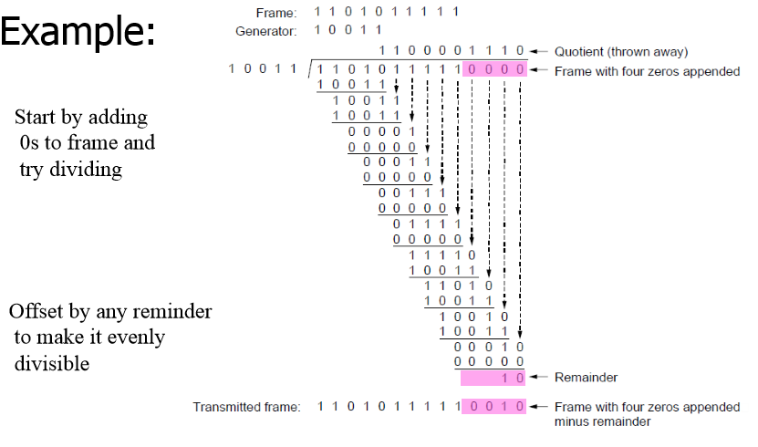

# 导语
计算机系统中，信息以二进制的方式存储，而检错在计信息传输的过程中十分重要。最近计网考试复习的时候觉得应该简单的总结一下检错手法（水一篇）
<!-- more -->
## 奇偶校验
奇偶校验分为奇校验和偶校验，都十分简单，只是在比特串后面加一个校验位，使得整个比特串的每一位异或为0（偶校验）或者1（奇校验）。
比如对一个8位长度的比特串10010011，进行奇校验之后就会为10010011 **1**，偶校验就会10010011 **0**
在传输过程中一般对应编码的一个码元加一个校验位。
奇偶校验的局限就是连着错偶数个就傻了。

## 海明校验
海明校验感觉就是进阶的奇偶校验。
对于数据位m的数据，加入k位的校验码,它应满足香农第二定理： **n=m+k ≤ 2^k-1**
m是数据的长度，k是校验码的长度
校验码分别插在第2^0、2^1……位

个人觉得好记一点的说法，第n个校验位校验的是位数的二进制第一位为n的所有位，比如1=1（2），3=11（2），5=（101）2，他们的2^0位都是1，所以第一个校验位都校验他们。最终要求是校验位和他们所校验的所有位的异或为0。
**指错字** 是将校验位和他们所校验的所有位数异或，如果没有出错的话就应该是0000……如果有一个位出错了，那么校验这个位的所有校验位算出来的指错字都会变成1，比如第3位错了，那么指错位1和指错位2都会变成1，指错字就会变成000011，那么我们就知道第3位出错了。
海明的局限也是出错两个以后会出现很多情况，指错字没法指出哪个地方是错的，有时候指错字为0000也不见得没有错误。

## 循环冗余校验CRC
CRC是传输过程中应用比较广泛的一个检错方法。
对于一个比特串x，发送方和接收方一起约定一个对应的长度为r的二进制串m，发送方在x后面加上r-1个0然后二进制除m，将得到的结果放在x的后面一起传输

接收方只需要将得到的比特串二进制除m，如果没有错误的话余数应该为0
CRC可以检测所有的1位、2位、奇数个位错误 、长度小于等于r的突发错误