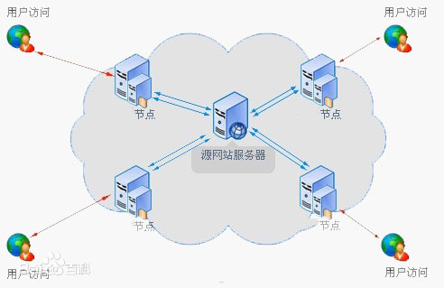
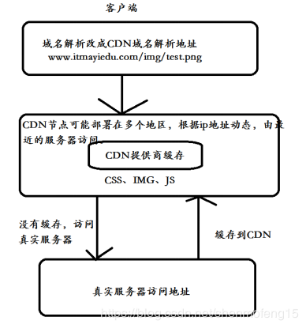

# 导语
我的憨憨同学们在群里炫耀起了他的烂橘子下apex可以达到10m/s，并且强力向我们安利他的加速器，说是还能一键修复origin平台，属实是居家旅行的必备好物。
然而实际上我们只需修改一下origin平台的cdn即可，多年以前搁学校下载的时候裸下就10多m/s，具体怎么操作，cdn是什么呢，容我随意的介绍一哈。
<!-- more -->
# 操作
首先到origin的安装目录下，找到EAcore.ini文件，如果你是憨憨经常找不到文件的位置，那我推荐你用 [everything](https://www.voidtools.com/zh-cn/)，他采用了更加高效的搜索排序算法能让你更快地根据文件名定位到具体的文件。
然后用什么文本修改工具打开它，向其中加上如下代码
```
[connection]
EnvironmentName=production

[Feature]
CdnOverride=akamai
```

保存，完事。
不过记得重启你的橘子客户端。
这段代码也很简单，设置了ASP.NET Core的hostenvironment（default值理论上好像也是production来着，感觉理论上不改也行，但我没试过），修改了cdn服务器，没了。

# 什么是cdn
CDN的全称是Content Delivery Network，即内容分发网络。CDN是构建在现有网络基础之上的智能虚拟网络，依靠部署在各地的边缘服务器，通过中心平台的负载均衡、内容分发、调度等功能模块，使用户就近获取所需内容，降低网络拥塞，提高用户访问响应速度和命中率。CDN的关键技术主要有内容存储和分发技术。CDN加速意思就是在用户和我们的服务器之间加一个缓存机制，通过这个缓存机制动态获取IP地址根据地理位置，让用户到最近的服务器访问。本质上就是拿空间换时间。

# cdn的组成

CDN网络中包含的功能实体包括内容缓存设备、内容交换机、内容路由器、CDN内容管理系统等组成。

内容缓存为CDN网络节点，位于用户接入点，是面向最终用户的内容提供设备，可缓存静态Web内容和流媒体内容，实现内容的边缘传播和存储，以便用户的就近访问。

内容交换机处于用户接入集中点，可以均衡单点多个内容缓存设备的负载，并对内容进行缓存负载平衡及访问控制。

内容路由器负责将用户的请求调度到适当的设备上。内容路由通常通过负载均衡系统来实现，动态均衡各个内容缓存站点的载荷分配，为用户的请求选择最佳的访问站点，同时提高网站的可用性。内容路由器可根据多种因素制定路由，包括站点与用户的临近度、内容的可用性、网络负载、设备状况等。负载均衡系统是整个CDN的核心。负载均衡的准确性和效率直接决定了整个CDN的效率和性能。

内容管理系统负责整个CDN的管理，是可选部件，作用是进行内容管理，如内容的注入和发布、内容的分发、内容的审核、内容的服务等。

# cdn的原理
CDN的基本原理是广泛采用各种缓存服务器，将这些缓存服务器分布到用户访问相对集中的地区或网络中，在用户访问网站时，利用全局负载技术将用户的访问指向距离最近的工作正常的缓存服务器上，由缓存服务器直接响应用户请求。
CDN的基本思路是尽可能避开互联网上有可能影响数据传输速度和稳定性的瓶颈和环节，使内容传输的更快、更稳定。通过在网络各处放置节点服务器所构成的在现有的互联网基础之上的一层智能虚拟网络，CDN系统能够实时地根据网络流量和各节点的连接、负载状况以及到用户的距离和响应时间等综合信息将用户的请求重新导向离用户最近的服务节点上。其目的是使用户可就近取得所需内容，解决 Internet网络拥挤的状况，提高用户访问网站的响应速度。

# cdn加速基本过程
1、用户向浏览器提供需要访问的域名

2、浏览器调用域名解析库对域名进行解析，由于CDN对域名解析过程进行了调整，所以解析函数库一般得到的是该域名对应的CNAME记录，为了得到实际的IP地址，浏览器需要再次对获得的CNAME域名进行解析以得到实际的IP地址；在此过程中，使用的全局负载均衡DNS解析。如根据地理位置信息解析对应的IP地址，使得用户能就近访问

3、此次解析得到CDN缓存服务器的IP地址，浏览器在得到实际的ip地址之后，向缓存服务器发出访问请求；

4、缓存服务器根据浏览器提供的要访问的域名，通过Cache内部专用DNS解析得到此域名的实际IP地址，再由缓存服务器向此实际IP地址提交访问请求

5、缓存服务器从实际IP地址得到内容以后，一方面在本地进行保存，以备以后使用，二方面把获取的数据放回给客户端，完成数据服务过程

6、客户端得到由缓存服务器返回的数据以后显示出来并完成整个浏览的数据请求过程



# akamai
于是我们就好气，这个akamai的cdn是啥玩意呢？
Akamai（阿卡迈）在1998年发明CDN技术架构之后组建公司，诞生于麻省理工学院，是CDN服务提供商，1999年NASDAQ上市。总部位于美国波士顿。
基本上都能对橘子加速，毕竟你周围全都没人用过橘子也说不过去，当然如果你真没上去速度当我没说。加速器平台估计一般也会整个类似cdn的，好歹也算做了事，但是你要是说修复客户端，然后说我加速器牛逼，我觉得还是有失偏颇的。

参考：
https://www.jianshu.com/p/ce98fbff39ac

