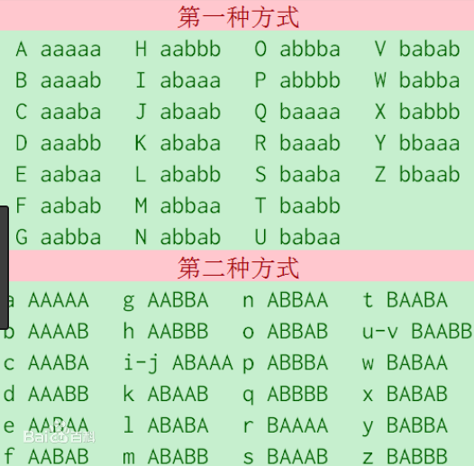
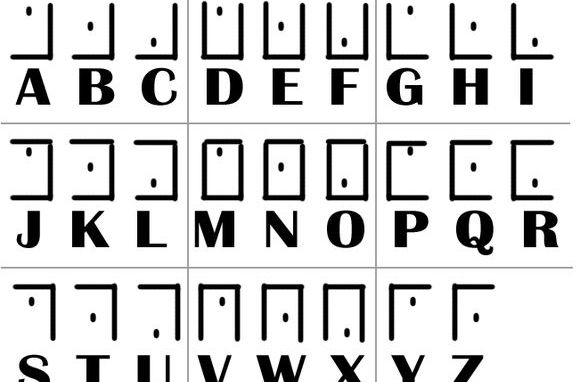
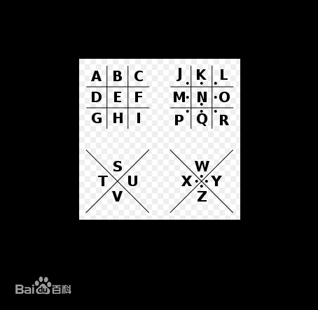

# 导语
在我们个人构架的小计算机系统中，常常会用到一些简单的小密码，这些小密码可以让我们的信息更加隐秘，同时不需要服务器付出太大的计算代价，对于更加庞大的计算机系统，尤其是保密性十分重要的计算机系统，更会用很强的密码，今天来介绍一些简单的密码。
<!-- more -->
## 凯撒密码
就是crypto=（plain+k） mod 26，是远古时期的密码，说到底人手写都可能自己就破解了。
其中ROT13密码就是k为13的凯撒密码

## 维吉尼亚密码
维吉尼亚密码的基础是凯撒密码，基本上就是加强了密钥的强度。在凯撒密码里，我们的密钥就是一个单纯的数字，而在维吉尼亚密码里，他变成了一个单词。
他的加密过程是：1、如果密钥没有明文长，那就多次重复密钥，让他和明文一样长。 2、对于明文中的第i位，加上密钥的第i位所代表的数字的凯撒密码
比如说我们设置维吉尼亚密码的单词为handsome，明文是gunishandsome，那么密文的对应是这样的
plain  gunishandsome
key    handsomehands
crypted g+h=o u+a=v……以此类推
这样就让破译变得困难了很多。

## 栅栏密码
栅栏密码其实就是调了下顺序，比如对
YOU ARE SO HANDSOME！
密钥可以为len('YOU ARE SO HANDSOME！')=20的因子245.这里我们取4吧，然后横着写竖着读或者竖着写横着读
YASAO
ORONM
UE DE
  HS!
密文就是YASAOORONMUE DE  HS!

## 培根密码
这个相当于另类的摩斯密码，只不过密文不是.-而是大小写或者加粗不加粗
对应的密码表这是这样的

## 猪圈密码
猪圈密码是用格子来代表明文的，格子就是对应的密码表

## 摩斯密码
这就不多解释了
点杠吗，谁不到啊？

# 工具
给大家一个好东西
[CTFCrackTools](https://github.com/Acmesec/CTFCrackTools)
虽然我知道大家都可以自己手写脚本，但是我觉得光写这么点有点混，所以再搁这儿多BB两句。

以后再整一整密码学学好了的那些牛逼一点的密码哦~