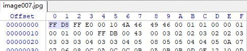
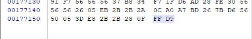
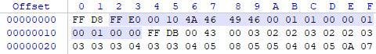
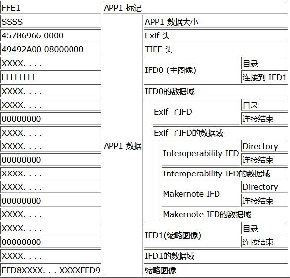
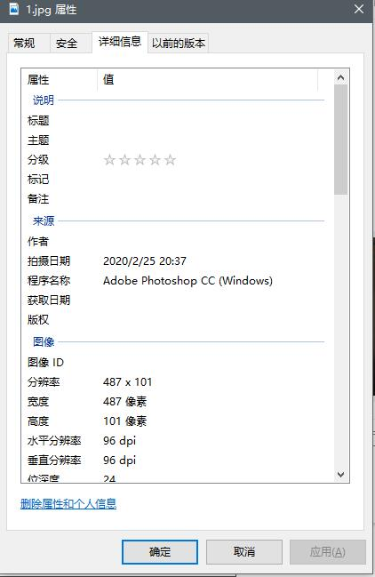
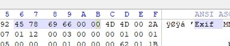
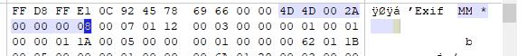
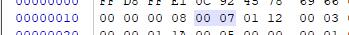
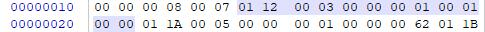

# 导语
今天的导语不想写了，么么哒。
反正蒙头就放EXIF的文档就完事了！
[Exif 2.3官方标准](http://www.cipa.jp/std/documents/e/DC-008-2012_E.pdf)
[Exif文件格式说明](https://web.archive.org/web/20111025004429/http://park2.wakwak.com/~tsuruzoh/Computer/Digicams/exif-e.html)
<!-- more -->
第二个是好东西，非常的全面细致，但是正如我们不愿意拿字典当完全的工具书，他有点超出我所需要的。好在我还搜到了大佬稍微整理了一下的。
[Exif文件格式描述](http://www.cppblog.com/lymons/archive/2013/06/09/108266.html)

# 什么是 EXIF？
基本上, Exif文件格式与JPEG 文件格式相同. Exif按照JPEG的规格在JPEG中插入一些 图像/数字相机 的信息数据以及缩略图像. 于是你能通过与JPEG兼容的互联网浏览器/图片浏览器/图像处理等一些软件 来查看Exif格式的图像文件. 就跟浏览通常的JPEG图像文件一样。

# 快速入门
## JPEG的格式和标记
JPEG文件开始于一个二进制的值 '0xFFD8', 结束与'0xFFD9'. 在JPEG的数据 中有好二进制 0xFFXX 的数据, 它们都统称作 **"标记"**, 并且它们代表了一段JPEG的 信息数据。 
0xFFD8是SOI图像起始(Start of image), 0xFFD9则是EOI图像结束 (End of image)。
这两个特殊的标记的后面都不跟随数据, 而其他的标记在后面则会附带数据。
标记的基本格式如下
**0xFF+标记号(1个字节)+数据大小描述符(2个字节)+数据内容(n个字节)**
比如我用winhex随手打开了一个jpg：

可以发现,开头确实是0xFFD8。

结尾也确实是0xFFD9

顺便分析一个tag:0xE0是标记号，表示这个tag的含义，0x0010是长度，16个字节，数据内容是后面的14个字节。
**NOTE**：
1 这里的 **长度** 是 **BigEndian** 
2 长度包含了长度字段本身，比如本例子上面明明是0x10但是数据只有14字节就这个原因。

## Exif所使用的标记
0xFFE0~0xFFEF之间的标记被叫做 **"应用标记"**, 它们在JPEG图像解码中不是必须存在的. 它们被使用于用户的应用程序之中。
例如, 老款的olympus/canon/casio/agfa数字相机使用JFIF(JPEG文件交换格式/JPEG File Interchange Format)来存储图像。JFIF使用APP0(0xFFE0) 标记来插入数字相机的配置信息数据和缩略图。
Exif也使用应用标记来插入数据, 但是Exif使用 APP1(0xFFE1)标记来避免与JFIF格式的冲突 且每一个 Exif 文件格式都开始于它。
**人话** Exif就是tag位置是E1的JPEG标记。

# Exif——实例一路解析
## Exif格式
数据结构如下

总结一下就是
**0xFFE1(标记号)+2字节(数据大小描述符)+6字节(ascii(EXIF)+00)+8字节(Tiff头)+2字节(目录项长度n)+n*12字节(目录项)+4字节(下一个目录偏移)**
### Exif头
Exif 数据开始于ASCII字符 "Exif" 和2个字节的0x00, 后面才是 Exif的数据. Exif 使用 TIFF 格式来存储数据。
前面那张图没有exif数据，这里换了个有exif的图片。



### Tiff头
TIFF格式中前8个字节是 TIFF 头. 其中最开始的前2个字节定义了 TIFF 数据的字节序. 如果这个值是 0x4949="I I"的话, 就表示按照 "Intel" 的字节序(Little Endian) 来排列数据. 如果是 0x4d4d="MM", 则说明按照 "Motorola" 的字节序(Big Endian)来排列数据
随后的两个字节是一个2字节长度的固定值 0x002A. 如果数据使用 Intel 字节序, 则这两个 字节的数据排列为 "0x2a,0x00". 如果是 Motorola 的, 则是 "0x00,0x2a". TIFF头的最后的 4个字节是到第一个 IFD(图像文件目录/Image File Directory, 将在下一节中描述)的偏移量. 这个偏移量是指从TIFF头("II" 或者 "MM")开始, 包含自己偏移量值的本身, 到下一个IFD为止的 长度的字节数. 通常地第一个 IFD 是紧挨着 TIFF 头出现的, 因此这个偏移量的值是 '0x00000008'

我选的这张图就是大端,所以0x4d4d，接着的是0x002a，第一个IFD是紧贴TIFF，所以接下来的是0x00000008。

### IFD
IFD是图像文件目录。
紧接TIFF头后是第一个IFD，前两个字节表示后面更了多少目录项，在最后一个目录项之后, 有 一个4个字节大小的数据,它意味着到下一个IFD的偏移量。如果这个值是'0x00000000',则表示它是最后一个IFD 并且不在跟任何的 IFD 相连接。
我这张图有7个目录项

每个目录项由12个字节构成
2字节标签号码，表示数据种类，2字节数据格式，4字节组件数目，4字节数据或者偏移量。
数据种类对应的意义如下表1
<table border="1">
    <tbody>
        <tr>
            <td>数据的值</td>
            <td>1</td>
            <td>2</td>
            <td>3</td>
            <td>4</td>
            <td>5</td>
            <td>6</td>
        </tr>
        <tr>
            <td>格式</td>
            <td>unsigned byte</td>
            <td>ascii strings</td>
            <td>unsigned short</td>
            <td>unsigned long</td>
            <td>unsigned rational</td>
            <td>signed byte</td>
        </tr>
        <tr>
            <td>组件的大小(字节数)</td>
            <td>1</td>
            <td>1</td>
            <td>2</td>
            <td>4</td>
            <td>8</td>
            <td>1</td>
        </tr>
        <tr>
            <td colspan="7"></td>
        </tr>
        <tr>
            <td>数据的值</td>
            <td>7</td>
            <td>8</td>
            <td>9</td>
            <td>10</td>
            <td>11</td>
            <td>12</td>
        </tr>
        <tr>
            <td>格式</td>
            <td>undefined</td>
            <td>signed short</td>
            <td>signed long</td>
            <td>signed rational</td>
            <td>single float</td>
            <td>double float</td>
        </tr>
        <tr>
            <td>组件的大小(字节数)</td>
            <td>1</td>
            <td>2</td>
            <td>4</td>
            <td>8</td>
            <td>4</td>
            <td>8</td>
        </tr>
    </tbody>
</table>

标签号码对应的意义如下表2
<table>
    <tbody>
        <tr>
            <td colspan="5">
            <center><font size="+1"><strong>IFD0 (主图像)使用的标签</strong></font></center></td>
        </tr>
        <tr>
            <td>标签号</td>
            <td>标签名</td>
            <td>格式</td>
            <td>组件数</td>
            <td>描述</td>
        </tr>
        <tr>
            <td>0x010e</td>
            <td>ImageDescription </td>
            <td>ascii string</td>
            <td><br></td>
            <td>用来描述图像. 双字节的字符码不能使用, 如 中文/韩文/日文.</td>
        </tr>
        <tr>
            <td>0x010f</td>
            <td>Make </td>
            <td>ascii string</td>
            <td><br></td>
            <td>表示数字相机的制造商. 在 Exif 标准中, 这个标签是可选的, 但是在DCF中它是必需的.</td>
        </tr>
        <tr>
            <td>0x0110</td>
            <td>Model </td>
            <td>ascii string</td>
            <td><br></td>
            <td>表示数字相机的模块代码. 在 Exif 标准中, 这个标签是可选的, 但在DCF中它也是必需的.</td>
        </tr>
        <tr>
            <td>0x0112</td>
            <td>Orientation </td>
            <td>unsigned short</td>
            <td>1 </td>
            <td>
            <table align="right">
                <tbody>
                    <tr>
                        <td>Value</td>
                        <td>0th Row</td>
                        <td>0th Column</td>
                    </tr>
                    <tr>
                        <td>1</td>
                        <td>top</td>
                        <td>left side</td>
                    </tr>
                    <tr>
                        <td>2</td>
                        <td>top</td>
                        <td>right side</td>
                    </tr>
                    <tr>
                        <td>3</td>
                        <td>bottom</td>
                        <td>right side</td>
                    </tr>
                    <tr>
                        <td>4</td>
                        <td>bottom</td>
                        <td>left side</td>
                    </tr>
                    <tr>
                        <td>5</td>
                        <td>left side</td>
                        <td>top</td>
                    </tr>
                    <tr>
                        <td>6</td>
                        <td>right side</td>
                        <td>top</td>
                    </tr>
                    <tr>
                        <td>7</td>
                        <td>right side</td>
                        <td>bottom</td>
                    </tr>
                    <tr>
                        <td>8</td>
                        <td>left side</td>
                        <td>bottom</td>
                    </tr>
                </tbody>
            </table>
            当拍照时, 相机相对于场景的方向. 在右边表示的是'0th row' 以及 '0th column' 在视觉位置上的关系.</td>
        </tr>
        <tr>
            <td>0x011a</td>
            <td>XResolution </td>
            <td>unsigned rational</td>
            <td>1 </td>
            <td rowspan="2">图像的 显示/打印 分辨率. 缺省值是 1/72英寸, 但是它没有意义因为个人PC在 显示/打印 图像的时候不使用这个值.</td>
        </tr>
        <tr>
            <td>0x011b</td>
            <td>YResolution </td>
            <td>unsigned rational</td>
            <td>1 </td>
        </tr>
        <tr>
            <td>0x0128</td>
            <td>ResolutionUnit </td>
            <td>unsigned short</td>
            <td>1 </td>
            <td>XResolution(0x011a)/YResolution(0x011b)的单位. '1' 表示没有单位, '2' 意味着英寸, '3' 表示厘米. 缺省值是 '2'(英寸).</td>
        </tr>
        <tr>
            <td>0x0131</td>
            <td>Software </td>
            <td>ascii string</td>
            <td><br></td>
            <td>显示固件的版本号(数字相机的内部控制软件).</td>
        </tr>
        <tr>
            <td>0x0132</td>
            <td>DateTime </td>
            <td>ascii string</td>
            <td>20 </td>
            <td>图像最后一次被修改时的日期/时间. 日期的格式是 "YYYY:MM:DD HH:MM:SS"+0x00, 一共 20个字节. 如果没有设置时钟或者数字相机没有时钟, 则这个域是用空格来填充. 通常, 它和DateTimeOriginal(0x9003)具有相同的值</td>
        </tr>
        <tr>
            <td>0x013e</td>
            <td>WhitePoint </td>
            <td>unsigned rational</td>
            <td>2 </td>
            <td>定义图像白点(white point/白点：在彩色分色、照相或摄影时作为色彩平衡测量用途的参考点) 的色度(chromaticity). 如果图像是用CIE标准照度 D65(著名的是 '光线/daylight'的国际标准), 这个值是 '3127/10000,3290/10000'.</td>
        </tr>
        <tr>
            <td>0x013f</td>
            <td>PrimaryChromaticities </td>
            <td>unsigned rational</td>
            <td>6 </td>
            <td>定义图像的原始色度. 如果图像使用 CCIR 推荐 709原始色度, 则这个值是 '640/1000,330/1000,300/1000,600/1000,150/1000,0/1000'.</td>
        </tr>
        <tr>
            <td>0x0211</td>
            <td>YCbCrCoefficients </td>
            <td>unsigned rational</td>
            <td>3 </td>
            <td>当图像的格式是 YCbCr(JPEG的格式), 这个值表示转换成 RGB格式的一个常量. 通常, 这个值是'0.299/0.587/0.114'.</td>
        </tr>
        <tr>
            <td>0x0213</td>
            <td>YCbCrPositioning </td>
            <td>unsigned short</td>
            <td>1 </td>
            <td>当图像的格式是 YCbCr 并且使用 '子采样/Subsampling'(色度数据的剪切值, 所有的数字相机都使用), 定义了subsampling 像素阵列的色度采样点. '1'表示像素阵列的中心, '2' 表示基准点.</td>
        </tr>
        <tr>
            <td>0x0214</td>
            <td>ReferenceBlackWhite </td>
            <td>unsigned rational</td>
            <td>6 </td>
            <td>表示黑点(black point)/白点 的参考值. 在YCbCr 格式中,前两个值是 Y的黑点/白点, 下两个值是 Cb, 最后两个值是 Cr. 而在 RGB 格式中, 前两个表示R的黑点/白点, 下两个是 G, 最后两个是 B.</td>
        </tr>
        <tr>
            <td>0x8298</td>
            <td>Copyright </td>
            <td>ascii string</td>
            <td><br></td>
            <td>表示版权信息</td>
        </tr>
        <tr>
            <td>0x8769</td>
            <td>ExifOffset </td>
            <td>unsigned long</td>
            <td>1 </td>
            <td>Exif 子IFD的偏移量</td>
        </tr>
    </tbody>
</table>

比如我们在这随便选一个目录项分析

0x0112  0003 00000001 00010000
0x0112 根据表2，表示这个标签是Orientation
0x0003 根据表1，表示数据格式是unsigned short
0x00000001 表示只有一个组件
0x00010000 表示所对应的值。（咋感觉不对劲啊？）

这些细节还有很多，在我最前面贴的链接里都能意义对照。

## 提取某些EXIF信息
包括java、python的很多语言都有对应的库实现，本来上面讲解那么细致应该是自己亲自动手实现的，但是我不走寻常路
我们用一手PIL（python imaging library）库
这是他的 [手册](https://pillow.readthedocs.io/en/stable/PIL.html)
这里有一个小点要注意，那就是PIL这个库改名叫pillow了，所以我们如果用pip安装他的话得用
`pip install Pillow -i https://pypi.tuna.tsinghua.edu.cn/simple`
然后是我们的脚本
```
from PIL import Image
from PIL.ExifTags import TAGS

def get_exif_data(fname):
    """Get embedded EXIF data from image file."""
    ret = {}
    try:
        img = Image.open(fname)
        if hasattr( img, '_getexif' ):
            exifinfo = img._getexif()
            if exifinfo != None:
                for tag, value in exifinfo.items():
                    decoded = TAGS.get(tag, tag)
                    ret[decoded] = value
    except IOError:
        print ('IOERROR ' + fname)
    return ret

if __name__ == '__main__':
    fileName = 'D:\\1.jpg'
    exif = get_exif_data(fileName)
    print (exif)
```
利用PIL的ExifTags模块，我们可以提取出对应的Exif标签。

# 后记
只要后期对脚本进行相应的改动即可得出想要的结果。

