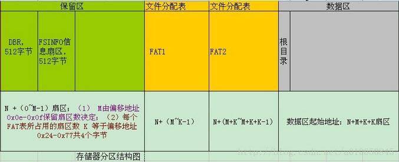
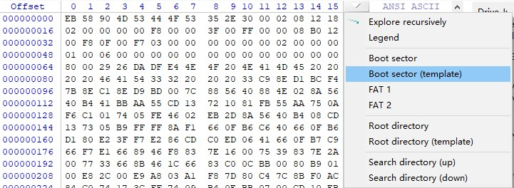
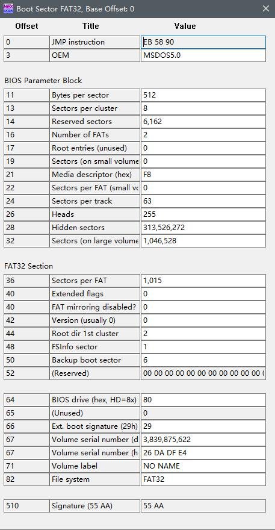
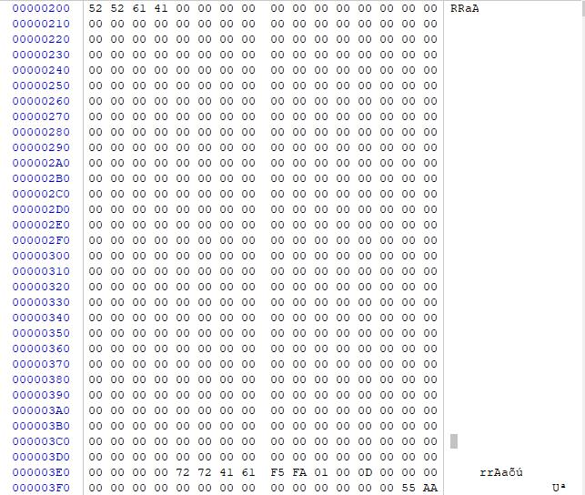
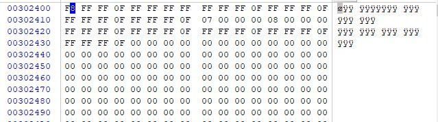
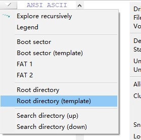

# 导语
了解文件在硬盘中的存放方式有利于我们更加简便简介的了解计算机系统。今天简述FAT32。
<!-- more -->
# FAT32文件系统结构
如图

# 动手实践
## MBR
管理员启动winhex，选择tools->open disk即可打开磁盘。
首先映入眼帘的是MBR。它占据512字节，描述了卷的各种性质。
    0x00\~0x02：3字节，跳转指令。
    0x03\~0x0A：8字节，文件系统标志和版本号。
    0x0B\~0x0C：2字节，每扇区字节数
    0x0D\~0x0D：1字节，每簇扇区数
    0x0E\~0x0F：2字节，保留扇区数
    0x10\~0x10：1字节，FAT表个数
    0x11\~0x12：2字节，FAT32必须等于0，FAT12/FAT16为根目录中目录的个数；
    0x13\~0x14：2字节，FAT32必须等于0，FAT12/FAT16为扇区总数。
    0x15\~0x15：1字节，哪种存储介质，0xF8标准值，可移动存储介质。
    0x16\~0x17：2字节，FAT32必须为0，FAT12/FAT16为一个FAT 表所占的扇区数。
    0x18\~0x19：2字节，每磁道扇区数，只对于“特殊形状”（由磁头和柱面分割为若干磁道）的存储介质有效。
    0x1A\~0x1B：2字节，磁头数，只对特殊的介质才有效。
    0x1C\~0x1F：4字节，EBR分区之前所隐藏的扇区数。
    0x20\~0x23：4字节，文件系统总扇区数。
    0x24\~0x27：4字节，每个FAT表占用扇区数。
    0x28\~0x29：2字节，标记，此域FAT32 特有。
    0x2A\~0x2B：2字节，FAT32版本号0.0，FAT32特有。
    0x2C\~0x2F：4字节，根目录所在第一个簇的簇号。（虽然在FAT32文件系统下，根目录可以存放在数据区的任何位置，但是通常情况下还是起始于2号簇）
    0x30\~0x31：2字节，FSINFO（文件系统信息扇区）扇区号0x01，该扇区为操作系统提供关于空簇总数及下一可用簇的信息。
    0x32\~0x33：2字节，备份引导扇区的位置。备份引导扇区总是位于文件系统的6号扇区。
    0x34\~0x3F：12字节，用于以后FAT 扩展使用。
    0x40\~0x40：1字节，与FAT12/16 的定义相同，只不过两者位于启动扇区不同的位置而已。
    0x41\~0x41：1字节，与FAT12/16 的定义相同，只不过两者位于启动扇区不同的位置而已 。
    0x42\~0x42：1字节，扩展引导标志，0x29。与FAT12/16 的定义相同，只不过两者位于启动扇区不同的位置而已
    0x43\~0x46：4字节，卷序列号。通常为一个随机值。
    0x47\~0x51：11字节，卷标（ASCII码），如果建立文件系统的时候指定了卷标，会保存在此。
    0x52\~0x59：8字节，文件系统格式的ASCII码，FAT32。
    0x5A\~0x1FD：共410字节，引导代码。
    0x1FE\~0x1FF：签名标志。 
    FAT文件系统将引导代码与文件形同数据结构融合在FAT32文件系统引导扇区的512字节中，90\~509字节为引导代码，而FAT12/16则是62\~509字节为引导代码。同时，FAT32还可以利用引导扇区后的扇区空间存放附加的引导代码。一个FAT卷即使不是可引导文件系统，也会存在引导代码。
winhex自带模板解析DBR。

## FSINFO扇区
FAT32在保留区中增加了一个FSINFO扇区，用以记录文件系统中空闲簇的数量以及下一可用簇的簇号等信息，以供操作系统作为参考。FSINFO信息扇区一般位于文件系统的1号扇区，结构非常简单。
winhex就没有整这个的模板，本来感觉也不是多有用来着。

    0x200\~0x203：4个字节，扩展引导标志。
    0x204\~0x3E3：480个字节，未使用，全部置0。
    0x3E4\~0x3E7：4个字节，FSINFO签名。
    0x3E8\~0x3EB：4个字节，文件系统的空簇数。
    0x3F0\~0x3FD：14个字节，未使用。
    0x3FE\~0x3FF：2个字节，“55 AA”标志。 
温馨提示：通常情况下，文件系统的2号扇区结尾也会被设置“55 AA”标志。6号扇区也会有一个引导扇区的备份，相应的7号扇区应该是一个备份FSINFO信息扇区，8号扇区可以看做是2号扇区的备份。

## FAT表
紧跟在保留分区后面的是FAT区，其由两个完全相同的FAT（File Allocation Table， 文件分配表）表单组成，FAT文件系统的名字也是因此而来。FAT 表是一组与数据簇号对应的列表。FAT2紧跟在FAT1之后，它的位置可以通过FAT1的位置加上FAT表的扇区数计算出来。
    文件系统分配磁盘空间按簇来分配。因此，文件占有磁盘空间时，基本单位不是字节而是簇，即使某个文件只有一个字节，操作系统也会给它分配一个最小单元：即一个簇。对于大文件，需要分配多个簇。同一个文件的数据并不一定完整地存放在磁盘中一个连续地区域内，而往往会分若干段，像链子一样存放。这种存储方式称为文件的链式存储。为了实现文件的链式存储，文件系统必须准确地记录哪些簇已经被文件占用，还必须为每个已经占用的簇指明存储后继的下一个簇的簇号，对于文件的最后一簇，则要指明本簇无后继簇。这些都是由FAT表来保存的，FAT 表对应表项中记录着它所代表的簇的有关信息：诸如是空，是不是坏簇，是否是已经是某个文件的尾簇等。
    对于文件系统来说，FAT表有两个重要作用：描述簇的分配状态以及标明文件或目录的下一簇的簇号。
    通常情况下，一个FAT文件系统会有两个FAT表，但有时也允许只有一个FAT表，FAT表的具体个数记录在引导扇区的偏移0x10字节处。
    由于FAT区紧跟在文件系统保留区后，所以FAT1在文件系统中的位置可以通过引导记录中偏移0x0E\~0x0F字节处的“保留扇区数”得到，即M值。
    FAT32中每个簇的簇地址是有32bit（4个字节），FAT表中的所有字节位置以4字节为单位进行划分，并对所有划分后的位置由0进行地址编号。0号地址与1号地址被系统保留并存储特殊标志内容。从2号地址开始，每个地址对应于数据区的簇号，FAT表中的地址编号与数据区中的簇号相同。我们称FAT表中的这些地址为FAT表项，FAT表项中记录的值称为FAT表项值。
    当文件系统被创建，也就是进行格式化操作时，分配给FAT区域的空间将会被清空，在FAT1与FAT2的0号表项与1号表项写入特定值。由于创建文件系统的同时也会创建根目录，也就是为根目录分配了一个簇空间，通常为2号簇，与之对应的2号FAT表项记录为2号簇，被写入一个结束标记。
    由于簇号起始于2号，所以FAT表项的0号表项与1号表项不与任何簇对应。FAT32的0号表项值总是“F8FFFF0F”。
    1号表项可能被用于记录脏标志，以说明文件系统没有被正常卸载或者磁盘表面存在错误。不过这个值并不重要。正常情况下1号表项值为“FFFFFFFF”或“FFFFFF0F”。
    如果某个簇未被分配使用，它对应的FAT表项值0；
    当某个簇已被分配使用，则它对应的FAT表项内的表项值也就是该文件的下一个存储位置的簇号。如果该文件结束于该簇，则在它的FAT表项中记录的是一个文件结束标记，对于FAT32而言，代表文件结束的FAT表项值为0x0FFFFFFF。
    如果某个簇存在坏扇区，则整个簇会用0xFFFFFF7标记为坏簇，这个坏簇标记就记录在它所对应的FAT表项中。
    在文件系统中新建文件时，如果新建的文件只占用一个簇，为其分配的簇对应的FAT表项将会写入结束标记。如果新建的文件不只占用一个簇，则在其所占用的每个簇对应的FAT表项中写入为其分配的下一簇的簇号，在最后一个簇对应的FAT表象中写入结束标记。
    新建目录时，只为其分配一个簇的空间，对应的FAT表项中写入结束标记。当目录增大超出一个簇的大小时，将会在空闲空间中继续为其分配一个簇，并在FAT表中为其建立FAT表链以描述它所占用的簇情况。

0号表项，0x0FFFFFF8，FAT表起始固定标识
1号表项，0x0FFFFFFF，不使用，默认值
2号表项，0x0FFFFFFF，标识文件结束，表项对应2号簇，根目录所在簇

## 目录项
在两个FAT表之后就是目录项root directory
    0x00-0x07：文件名，不足8个字节0x20补全(短文件名8.3命名规则)
    0x08-0x0A：扩展名
    0x0B：文件属性，0x20表示归档
    0x0D：创建时间的10毫秒位
    0x0E-0x0F：文件创建时间
    0x10-0x11：文件创建日期
    0x12-0x13：文件最后访问日期
    0x14-0x15：文件起始簇号的高16位
    0x16-0x17：文件最近修改时间
    0x18-0x19：文件最近修改日期
    0x1A-0x1B：文件起始簇号的地16位
    0x1C-0x1F：文件的长度，0x2206=8710bytes=8.5K 
winhex也带有目录项的分析模板

## 数据
数据是按簇挨个存放着的。

# 总结
那么总结来说整个卷是这样子的
**保留区扇区数[512字节(DBR)+512字节(FSINFO信息)+剩下的保留区]+FAT扇区数+FAT扇区数+根目录+数据区**

参考：
https://blog.csdn.net/li_wen01/article/details/79929730

