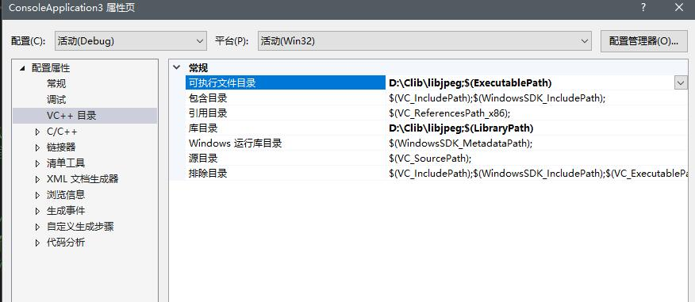
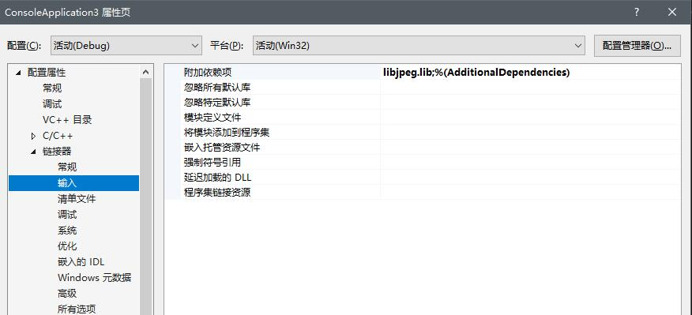

# 导语
libjpeg对jpeg的功能实在是太强大了，下面简单介绍一下怎么在VS2017下安装使用。
<!-- more -->

# 下载
http://www.ijg.org/
windows平台选择zip即可

# 编译
我们是在windows平台下，所以要么使用cmake要么使用nmake，但是我们又有VS2017，因此我们可以使用VS2017的nmake（如果你在安装的时选择工具集的时候选择了C++的桌面开发的话他是已经准备好的，当然你也可以亲自去下个cmake或者nmake）

首先解压，在一大堆文件中将jconfig.vc改名为jconfig.h
然后打开makefile.vc,把里面的win32.mak换成自己电脑上的win32.mak的路径，或者直接把win32.mak复制一个到这个文件夹下。
这里有的人可能没有win32.mak这个东西，好像是因为win10系统的VS都没有。因此放个链接自取
https://github.com/nurmi-labs/ms-sdk
然后打开VS命令行，cd到解压的位置，然后
```
nmake -f makefile.vc
```
至此，解压就完成了。

# 在VS2017中引入libjpeg
理论上我们只需要编译后的文件，但是我比较懒我就直接把全部的都存起来了，然后在VS的项目-属性-配置属性-VC++目录的可执行文件目录 以及库文件目录都添上编译好的那个文件夹的位置

然后再在链接器-输入-附加依赖项添加一个libjpeg
即可。

在引入时，使用# include\<jpeglib\>即可。