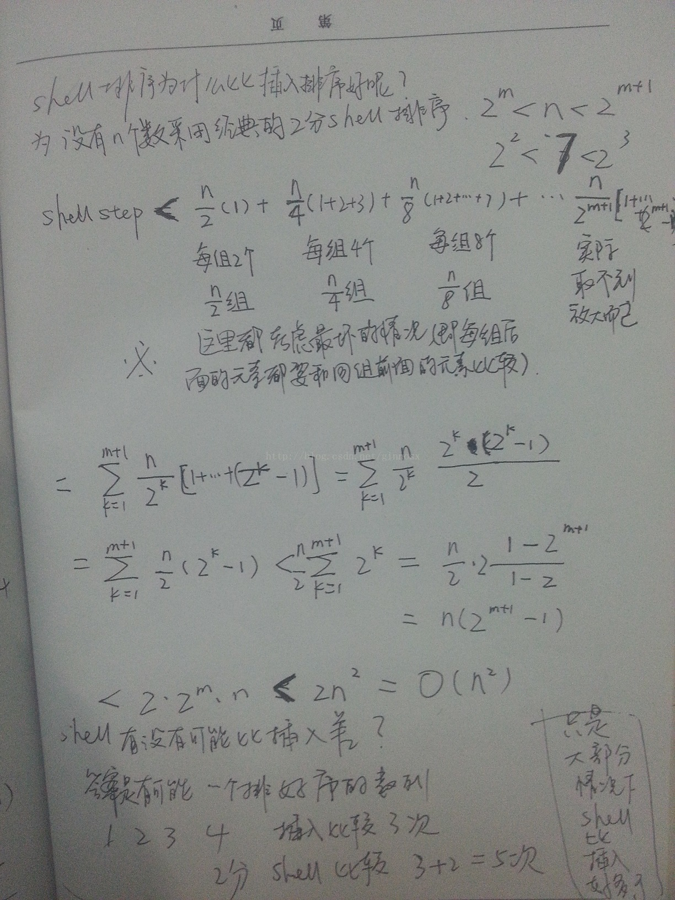

# 导语
排序算法是非常基础常用的算法，简单总结一下。
注：没有代码！没有代码！没有代码！只有思路
<!-- more -->

这个youtuber传了几个有趣的3d动画的排序时间复杂度对比，有条件的胖友可以去康康
https://www.youtube.com/user/udiprod

## 解释
k：桶个数
in-place：不占用额外内存
out-place：占用额外内存

# 冒泡排序
每轮从头开始比较相邻的元素，如果第一个比第二个大（小），就交换位置，否则不交换，这样就可以使最大（小）的元素在数组的尾部。第i轮可以将第i大（小）的元素放在倒数第i位。同时如果在第i轮发现没有任何元素交换位置就说明已经排序成功。

最优时间复杂度在整个数组恰好顺序于所需要的顺序，只需要扫描第一遍就能发现是没有交换位置，也就是说明排序成功了。T(n)=n=O(n)
最差时间复杂度在整个数组恰好倒序于所需要的顺序，T(n)=(n-1)+(n-2)+……+1=(n-2)\*n/2=O($n^2$)
平均情况是O($n^2$)

# 选择排序
每一轮都扫描全部的元素，找到最大(小)的那个元素，然后把它和未排序序列的第一个（也就是已排序序列的下一个）交换位置。

因为他每一轮其实不管未排序序列的情况如何，都需要挨个比较一边，所以他的复杂度稳定，永远是O($n^2$)

# 插入排序
插入排序将整个序列分为有序部分和无序部分两个部分，开始时有序部分为空，而无序部分为整个序列。
在每一轮，拿出无序部分的第一个元素，在有序部分中找到他应该在的位置插入，使得有序部分仍保持有序。

最优时间复杂度在整个数组恰好顺序于所需要的顺序，每一次拿一个无序序列的元素就能直接一步到胃插入到对的位置，T(n)=n=O(n)
最差时间复杂度在整个数组恰好倒序于所需要的顺序，每次拿到元素都要扫描整个有序序列才能找到对的位置。T(n)=(n-1)+(n-2)+……+1=(n-2)\*n/2=O($n^2$)
平均情况是O($n^2$)

# 希尔排序
希尔排序是非常有地位的一个算法，由希尔在1959年提出，它的基本思想也是插入排序，但经过了优化改进之后使得它的复杂度突破了O($n^2$)。希尔排序又叫缩小增量排序
希尔排序的思想是将整个待排序的序列依据一定的增量来分组，对每一组采用直接插入排序的方式来排序，然后缩小增量再次分组，然后再次排序，如此循环。在经典的希尔排序里，这个增量是2/n,4/n,8/n……

每经过一轮分组，整个序列就会越趋向于有序，也就是在下一轮时分组内的插入排序会趋向于简单。
可以把算法看成两个步骤，第一个步骤是分组，第二个步骤是插入排序。
分组的时间复杂度都是$\log_2{n}$，因此评价希尔排序的最优和最劣主要还是看直接插入排序过程里的复杂度。

迄今为止，还无法从理论上精准地分析希尔排序的效率，有各种各样基于试验的评估，估计它的时间级介于O(N3/2)与O(N7/6)之间。我们可以认为希尔排序的平均时间复杂度为O(N\*(logN)2)。专家们提倡，几乎任何排序工作在开始时都可以用希尔排序，若在实际使用中证明它不够快，再改成快速排序这样更高级的排序算法。
然而，Donald Knuth提出使用h=3*h+1的序列让增量之间互质可以有效的提高效率。

# 归并排序
归并排序使用了分治思想，分治就是“分而治之”，将大问题细分为小问题，将序列分为小的子序列，将每个子序列变得有序，然后在合并有序的子序列，最终使得整个序列都有序。
经典的归并排序即二路归并，首先将整个序列分为两个n/2长度的子序列，对每个子序列再二分，一直分到序列只有一个元素，自然有序为止。这是归并中的“归”：归一
然后在对子序列进行归并中的“并”：合并
因为两个子序列都是有序的，因此我们可以很快地将两个子序列合并成有序的一个序列。

最佳情况全部有序，只有在合并过程中的一次次比较扫描了整个序列，因此复杂度为T(n)=$\log_2{n}$+n=O(n)
最差情况全部无序，每一次合并都全部扫描，复杂度为O($n\log_2{n}$)
平均情况是O($n\log_2{n}$)

# 快速排序
快速排序首先选择一个元素作为基准，然后将剩下的所有元素分为比基准大的元素们和比基准小的元素们，然后将基准差在他们俩中间，然后分别对这两个部分进行快速排序。

在最优情况下，Partition每次都划分得很均匀，如果排序n个关键字，其递归树的深度就为.log2n.+1（.x.表示不大于x的最大整数），即仅需递归log2n次，需要时间为T（n）的话，第一次Partiation应该是需要对整个数组扫描一遍，做n次比较。然后，获得的枢轴将数组一分为二，那么各自还需要T（n/2）的时间（注意是最好情况，所以平分两半）。于是不断地划分下去，我们就有了下面的不等式推断。
T（n）≤2T（n/2） +n，T（1）=0  
T（n）≤2（2T（n/4）+n/2） +n=4T（n/4）+2n  
T（n）≤4（2T（n/8）+n/4） +2n=8T（n/8）+3n  
……  
T（n）≤nT（1）+（log2n）×n= O(nlogn) 
此时复杂度为O($n\log_2{n}$)
最差情况下，每次划分只得到一个比上一次划分少一个记录的子序列，直接退化为冒泡排序，复杂度O($n^2$)
平均情况O($n\log_2{n}$)

# 堆排序
堆排序是依据堆的数据结构而设计的一种算法。堆是一个近似完全二叉树的结构，并且子节点的键值或索引总是小于（或大于）它的父节点。
堆排序就是将待排序按照树的结构插进去，然后用堆的组成算法把它变成一个大顶堆。然后根据这个大顶堆的性质，根节点是最大的，所以我们把它掏出来，让最底层的节点放在根节点上，这时显然这个堆不是一个堆（？），所以再利用堆的操作将他变成正确的堆，这也就将最大的节点又放在了根节点上。

最优、最劣、平均算法复杂度都为O($n\log_2{n}$)

# 计数排序
计数排序是利用一段新的内存空间来加快存储的，是非常经典的空间复杂度换时间复杂度的算法。它将输入的数据当做键来存储在相应的数组之中，具体过程如下。
首先申请一个长度为k的数组a，k为输入元素的最大值和最小值的差（后面假设从0开始），然后扫描待排序数组，将大小为i的数字放在a[i]处。
然后从前往后扫描a数组，从第二个开始，a[i]+=a[i-1]，这样就使a[i]的意义从“大小为i的数字的个数”变成了“小于等于i的数字的个数”
然后再从后往前的将a数组里的数字掏出来，这么做是为了保持算法的稳定性。

作为用空间换时间的算法，它的时间复杂度为T(n) = O(n+k)，k为多申请的数组大小。

# 桶排序
桶排序是计数排序的升级版。它利用了函数的映射关系，高效与否的关键就在于这个映射函数的确定。
将数据分到有限数量的桶里，每个桶再分别排序（有可能再使用别的排序算法或是以递归方式继续使用桶排序进行排序）
这张图一放就能看懂了

复杂度同样如计数排序O(n+k)

# 基数排序
基数排序就是按照低位先排序，然后收集；再按照高位排序，然后再收集；依次类推，直到最高位。有时候有些属性是有优先级顺序的，先按低优先级排序，再按高优先级排序。最后的次序就是高优先级高的在前，高优先级相同的低优先级高的在前。基数排序基于分别排序，分别收集，所以是稳定的。

每轮一位都需要n次运算，所以时间复杂度为O(kn)（k指待排序的数最大有多少位）当然他也需要额外空间。

参考：
https://blog.csdn.net/weixin_41190227/article/details/86600821
https://blog.csdn.net/ginnosx/article/details/12263619
https://www.cnblogs.com/mark-meng/p/6045882.html
https://blog.csdn.net/weshjiness/article/details/8660583
https://blog.csdn.net/liyue199512/article/details/52149489

