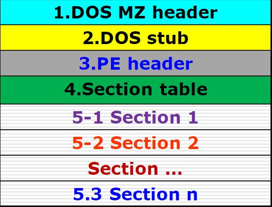
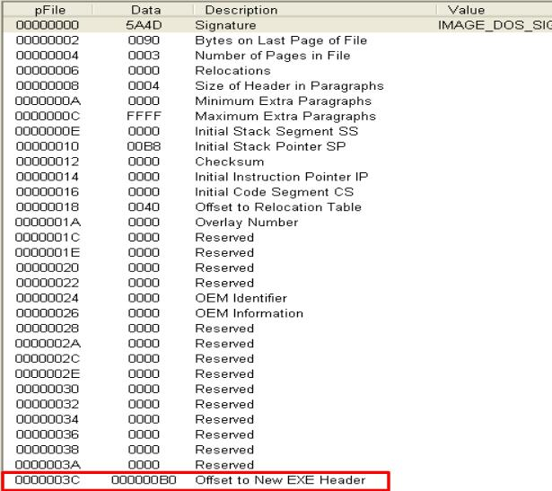
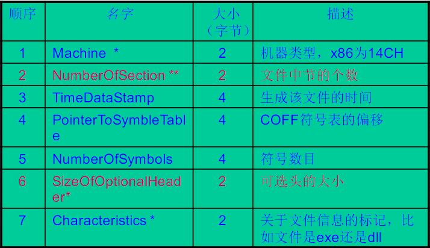
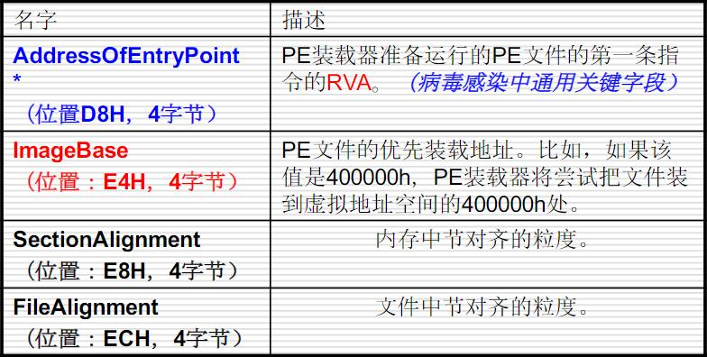
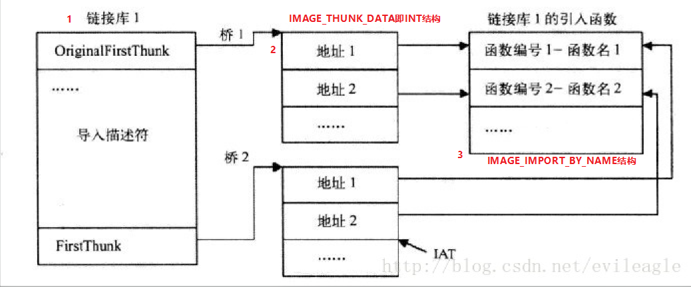
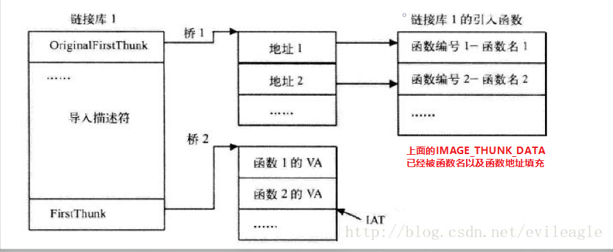
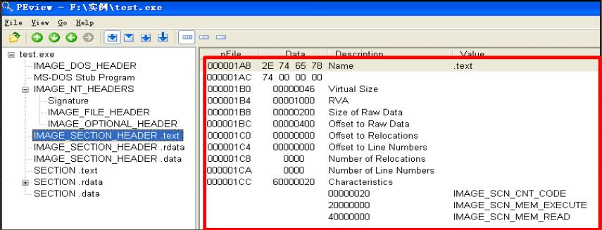

# 导语
如果你想学习PE病毒的编写，那么你首先得知道PE的格式和他的工作原理。
<!-- more -->

# PE的百度百科
PE(Protable Executable),即可移植的执行体。在Windows操作系统平台下，所有的可执行文件如EXE文件、DLL文件、SYS文件、OCX文件、COM文件等均使用PE结构。

# PE文件的结构
一张简简单单的图送给各位

还有一个比较详细的pdf送给各位
链接：https://pan.baidu.com/s/1SGU2AUQvzoHU9Foxx1-UYQ 提取码：ckdi 

## MS-DOS（DOS头）=MZ文件头+DOS Stub
DOS头的作用是定位文件PE头的开始位置，也可用于PE文件的合法性检查。而在DOS下运行时则会提示用户本文件不能在DOS下运行。在C语言的Windows.h中有预定义的数据结构IMAGE_DOS_HEADER如下
```
typedef struct _IMAGE_DOS_HEADER {      // DOS .EXE header
    WORD   e_magic;                     // Magic number
    WORD   e_cblp;                      // Bytes on last page of file
    WORD   e_cp;                        // Pages in file
    WORD   e_crlc;                      // Relocations
    WORD   e_cparhdr;                   // Size of header in paragraphs
    WORD   e_minalloc;                  // Minimum extra paragraphs needed
    WORD   e_maxalloc;                  // Maximum extra paragraphs needed
    WORD   e_ss;                        // Initial (relative) SS value
    WORD   e_sp;                        // Initial SP value
    WORD   e_csum;                      // Checksum
    WORD   e_ip;                        // Initial IP value
    WORD   e_cs;                        // Initial (relative) CS value
    WORD   e_lfarlc;                    // File address of relocation table
    WORD   e_ovno;                      // Overlay number
    WORD   e_res[4];                    // Reserved words
    WORD   e_oemid;                     // OEM identifier (for e_oeminfo)
    WORD   e_oeminfo;                   // OEM information; e_oemid specific
    WORD   e_ress2[10];                  // Reserved words
    LONG   e_lfanew;                    // File address of new exe header
  } IMAGE_DOS_HEADER, *PIMAGE_DOS_HEADER;
```

### MZ文件头
MZ文件头是真正意义的DOS头，其中包含了以下文件信息

```
typedef struct _IMAGE_DOS_HEADER {      // DOS .EXE header
    WORD   e_magic;                     // Magic number
    WORD   e_cblp;                      // Bytes on last page of file
    WORD   e_cp;                        // Pages in file
    WORD   e_crlc;                      // Relocations
    WORD   e_cparhdr;                   // Size of header in paragraphs
    WORD   e_minalloc;                  // Minimum extra paragraphs needed
    WORD   e_maxalloc;                  // Maximum extra paragraphs needed
    WORD   e_ss;                        // Initial (relative) SS value
    WORD   e_sp;                        // Initial SP value
    WORD   e_csum;                      // Checksum
    WORD   e_ip;                        // Initial IP value
    WORD   e_cs;                        // Initial (relative) CS value
    WORD   e_lfarlc;                    // File address of relocation table
    WORD   e_ovno;                      // Overlay number
    WORD   e_res[4];                    // Reserved words
    WORD   e_oemid;                     // OEM identifier (for e_oeminfo)
    WORD   e_oeminfo;                   // OEM information; e_oemid specific
    WORD   e_res2[10];                  // Reserved words
    LONG   e_lfanew;                    // File address of new exe header
  } IMAGE_DOS_HEADER, *PIMAGE_DOS_HEADER;
```
### DOS Stub
DOS Stub主要是为了兼容DOS操作系统，目的是当这个文件在MS-DOS上运行时提示一段文字，大部分情况下是：This program cannot be run in DOS mode。

## PE header
PEheader是PE相关结构NT映像头（IMAGE_NT_HEADER）的简称，其中包含许多PE装载器用到的重要字段。
同样的我们看看C语言中对IMAGE_NT_HEADER的预定义(我们先只研究32位下的咯)
```
typedef struct _IMAGE_NT_HEADERS {
    DWORD Signature;
    IMAGE_FILE_HEADER FileHeader;
    IMAGE_OPTIONAL_HEADER32 OptionalHeader;
} IMAGE_NT_HEADERS32, *PIMAGE_NT_HEADERS32;

#ifdef _WIN64
typedef IMAGE_NT_HEADERS64                  IMAGE_NT_HEADERS;
typedef PIMAGE_NT_HEADERS64                 PIMAGE_NT_HEADERS;
#else
typedef IMAGE_NT_HEADERS32                  IMAGE_NT_HEADERS;
typedef PIMAGE_NT_HEADERS32                 PIMAGE_NT_HEADERS;
#endif
```

### 提示字串（signature） 
这儿就是一个DWORD，内容是50h,45h,00h,00h,也就是ascii的PE空格空格

### 映像文件头（FileHeader）
包含了PE文件物理分布信息，比如节数目、后续可选文件头大小、及其类型等等
定义如下
```
typedef struct _IMAGE_FILE_HEADER {
    WORD    Machine;
    WORD    NumberOfSections;
    DWORD   TimeDateStamp;
    DWORD   PointerToSymbolTable;
    DWORD   NumberOfSymbols;
    WORD    SizeOfOptionalHeader;
    WORD    Characteristics;
} IMAGE_FILE_HEADER, *PIMAGE_FILE_HEADER;
```



###可选文件头（OptionalHeader）
定义了PE文件许多的关键信息，入内存镜像加载地址、程序入口点、节在文件和内存中的对齐粒度、程序在内存中的镜像大小、文件大小等等。定义如下<span id="jump"></span>
```
typedef struct _IMAGE_OPTIONAL_HEADER {
    //
    // Standard fields.
    //

    WORD    Magic;
    BYTE    MajorLinkerVersion;
    BYTE    MinorLinkerVersion;
    DWORD   SizeOfCode;
    DWORD   SizeOfInitializedData;
    DWORD   SizeOfUninitializedData;
    DWORD   AddressOfEntryPoint;
    DWORD   BaseOfCode;
    DWORD   BaseOfData;

    //
    // NT additional fields.
    //

    DWORD   ImageBase;
    DWORD   SectionAlignment;
    DWORD   FileAlignment;
    WORD    MajorOperatingSystemVersion;
    WORD    MinorOperatingSystemVersion;
    WORD    MajorImageVersion;
    WORD    MinorImageVersion;
    WORD    MajorSubsystemVersion;
    WORD    MinorSubsystemVersion;
    DWORD   Win32VersionValue;
    DWORD   SizeOfImage;
    DWORD   SizeOfHeaders;
    DWORD   CheckSum;
    WORD    Subsystem;
    WORD    DllCharacteristics;
    DWORD   SizeOfStackReserve;
    DWORD   SizeOfStackCommit;
    DWORD   SizeOfHeapReserve;
    DWORD   SizeOfHeapCommit;
    DWORD   LoaderFlags;
    DWORD   NumberOfRvaAndSizes;
    IMAGE_DATA_DIRECTORY DataDirectory[IMAGE_NUMBEROF_DIRECTORY_ENTRIES];
} IMAGE_OPTIONAL_HEADER32, *PIMAGE_OPTIONAL_HEADER32;
```

### 名词解释
**ImageBase**：PE文件在内存中安装在地址
**RVA地址**：Relative Virtual Address，相虚拟地址，他是相对于ImageBase的偏移位置。
**对齐粒度**：文件中节的对齐粒度就是文件一个节的长度，内存中节的对齐粒度就是内存中一个节的长度。
在磁盘中就按照文件的对齐粒度IMAGE_OPTIONAL_HEADER.FileAlignment对齐，在装载到内存中去运行的时候就按照内存中的节的对齐粒度IMAGE_OPTIONAL_HEADER.SectionAlignment对齐。
常见情况下内存的对齐粒度是0x1000，而文件的对齐粒度是0x200，这样做是为了与磁盘的扇区大小和内存单元的大小对齐。

### 可选文件头中比较重要的关键字
如图


#### 输入表
输入表是记录PE输入函数相关信息的一张表，他记录了PE文件在运行过程中调用动态链接库的一些函数的名称和地址。输入表分为输入名称表（INT）和输入地址表（IAT）。

在[之前](#jump)的IMAGE_OPTIONAL_HEADER那里可以看到有一个IMAGE_DATA_DIRECTORY DataDirectory[IMAGE_NUMBEROF_DIRECTORY_ENTRIES]的内容,他的数据结构如下，就是简单地偏移量和大小的数据分块，一共分了16块，每一块都有对应的内容。
```
typedef struct _IMAGE_DATA_DIRECTORY {
    DWORD   VirtualAddress;
    DWORD   Size;
} IMAGE_DATA_DIRECTORY, *PIMAGE_DATA_DIRECTORY;
```
IMAGE_NUMBEROF_DIRECTORY_ENTRIES为2的data directory内装的是一个叫做IMAGE_IMPORT_DESCRIPTOR的数据结构（IID）， 
```
typedef struct _IMAGE_IMPORT_DESCRIPTOR {
    union {
        DWORD   Characteristics;            // 0 for terminating null import descriptor
        DWORD   OriginalFirstThunk;         // RVA to original unbound IAT (PIMAGE_THUNK_DATA)
    } DUMMYUNIONNAME;
    DWORD   TimeDateStamp;                  // 0 if not bound,
                                            // -1 if bound, and real date\time stamp
                                            //     in IMAGE_DIRECTORY_ENTRY_BOUND_IMPORT (new BIND)
                                            // O.W. date/time stamp of DLL bound to (Old BIND)

    DWORD   ForwarderChain;                 // -1 if no forwarders
    DWORD   Name;
    DWORD   FirstThunk;                     // RVA to IAT (if bound this IAT has actual addresses)
} IMAGE_IMPORT_DESCRIPTOR;
```
Name：输入的DLL的名字指针，它是一个以00结尾的ASCII字符的RVA地址，该字符串包含输入的DLL名。例如：KERNEL32.DLL，或者USER32.DLL。
FirstThunk：包含指向输入地址表（IAT）的RVA。IAT也是指向IAMGE_THUNK_DATA结构，他的格式如下。
```
typedef struct _IMAGE_THUNK_DATA32 {
    union {
        DWORD ForwarderString;      // PBYTE 
        DWORD Function;             // PDWORD
        DWORD Ordinal;
        DWORD AddressOfData;        // PIMAGE_IMPORT_BY_NAME
    } u1;
} IMAGE_THUNK_DATA32;
typedef IMAGE_THUNK_DATA32 * PIMAGE_THUNK_DATA32;
```
ForwarderString 指向一个转向者字符串的RVA； 
Function 被输入的函数的内存地址
Ordinal 被输入的API的序数值
AddressOfData又指向一个IMAGE_IMPORT_BY_NAME的数据结构

如果其最高位为1，那么除去最高位的值就是函数的导出符号，即union是Ordinal。如果不为1，则他是一个指向一个IMAGE_IMPORT_BY_NAME的指针，即union是AddressofData
```
typedef struct _IMAGE_IMPORT_BY_NAME {
    WORD    Hint;
    CHAR   Name[1];
} IMAGE_IMPORT_BY_NAME, *PIMAGE_IMPORT_BY_NAME;
```
Hint字段：指示本函数在其所驻留的输出表的中序号该域被PE装载器用来在DLL的输出表里快速查询。该值不是必须的，一些链接器将此值设为0；
NAME字段：这个字段比较重要。它含有输入函数的函数名，函数名是一个ASCII码字符串，并以NULL结尾。注意，这里虽然将NAME的大小定义为字节，其实他是可变的。

通过上面的了解大概我们都会疑惑**为什么这两个数组都要指向IMAGR_IMPORT_BY_NAME结构？**原因如下：
第一，第一个由OriginalFrist通过IMAGE_THUNK_DATA结构所指向的IMAGE_IMPORT_BY_NAME是单独的一项，而且IMAGE_THUNK_DATA的值不可以更改，这个IMAGE_THUNK_DATA组成的数组就是INT，其实它是为FristThunk做为提示用的。
第二，第二个由FristThunk所指向的IMAGE_THUNK_DATA的值是由PE装载器填写的，他们的值构成了IAT。PE装载器首先搜索OringinalFristThunk，通过它所指向的INT结构中的每个IMAGE_IMPORT_BY_NAME所指向的每个被载入函数的地址。然后通过加载器将值填充到FristThunk指向的IAT表中。可以简单粗暴地Firsttrunk理解为RVA。



## 节表
顾名思义，是存放节表项的，相当于节的目录。
节表项包含 节名、节在文件和内存中的开始地址、长度、节属性等。

```
typedef struct _IMAGE_SECTION_HEADER {
    BYTE    Name[IMAGE_SIZEOF_SHORT_NAME];
    union {
            DWORD   PhysicalAddress;    
            DWORD   VirtualSize;
    } Misc;
    DWORD   VirtualAddress;                  // 节区的 RVA 地址
    DWORD   SizeOfRawData;                   // 在文件中对齐后的尺寸
    DWORD   PointerToRawData;                // 在文件中的偏移量
    DWORD   PointerToRelocations;            // 在OBJ文件中使用，重定位的偏移
    DWORD   PointerToLinenumbers;            // 行号表的偏移（供调试使用地）
    WORD    NumberOfRelocations;             // 在OBJ文件中使用，重定位项数目
    WORD    NumberOfLinenumbers;             // 行号表中行号的数目
    DWORD   Characteristics;                 // 节属性如可读，可写，可执行
} IMAGE_SECTION_HEADER, *PIMAGE_SECTION_HEADER;
```
可能大家会有疑问，virtualaddress和pointertorawdata的区别是什么，其实很简单，VirtualAddress是指内存中的rva（相对虚地址），PointerToRawData是指文件中的偏移

### 节属性
0x00000020? 这个块包含代码。置位
0x00000040? 这个块包含已初始化的数据
0x00000080? 这个块包含未初始化的数据（如.bss 块）
0x00000200? 这个块包含注释或其它的信息。
0x00000800? 这个块的内容不应放进最终的EXE文件中。
0x02000000? 这个块可以被丢弃，因为一旦它被载入，其进程就不需要它。最通常的可丢弃块是基本重定位块（.reloc ）。
0x10000000? 这个块是可共享的。
0x20000000? 这个块是可执行的。
0x40000000? 这个块是可读的。
0x80000000? 这个块是可写的。

## 节
节就是程序主体了，一般PE文件有很多节，比较常见的有
代码节
数据节
引入函数节
资源节等(如图标)
引出函数节（DLL文件中常见）
重定位节（DLL文件中常见）

# PE程序执行流程
PE程序主要依赖PE程序装载器，在检查了头部信息（包括引入函数表的地址信息装入等等）之后会读取节表，根据节表来动态的将各节的内容装入内存中。这个过程中会自动的修改代码段中的jmp的地址值使它能够成功。
这点儿知识对下个PE病毒编写有好处，尽请期待。


参考：
https://blog.csdn.net/qq_40422314/article/details/89741040
https://www.cnblogs.com/2f28/p/9800992.html