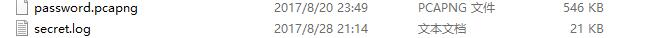
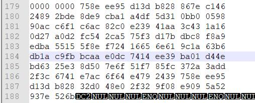
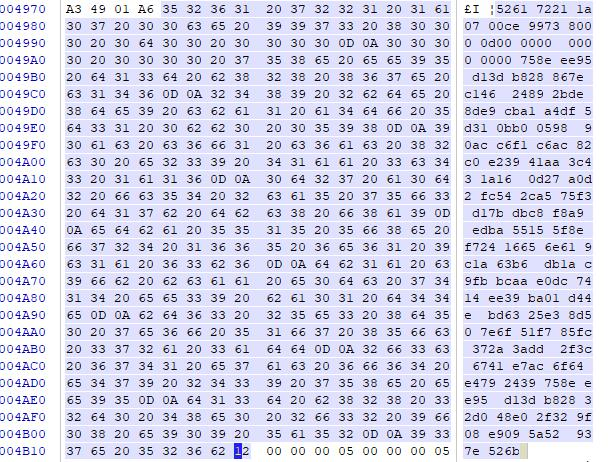
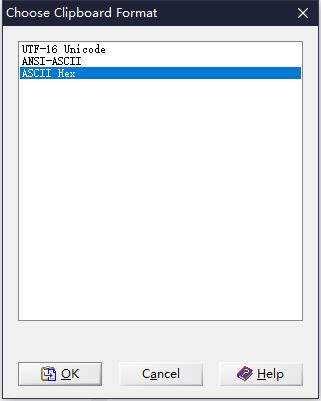
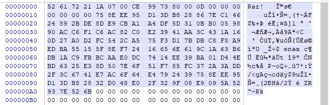
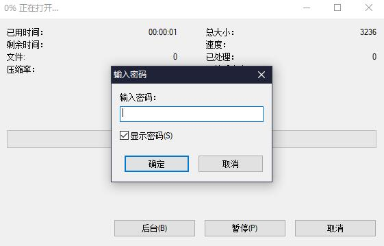
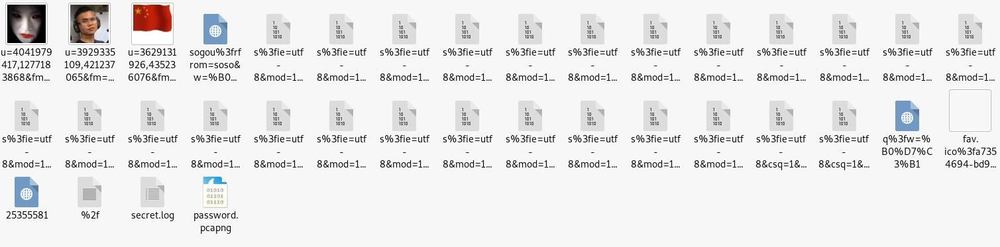
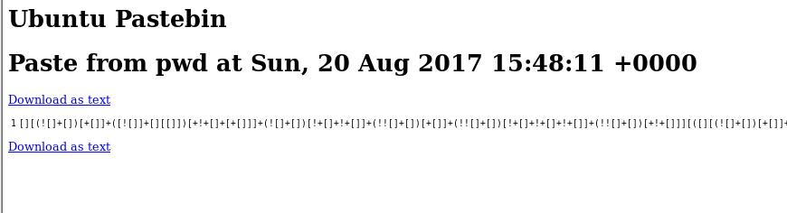
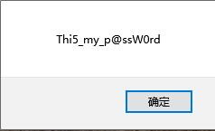
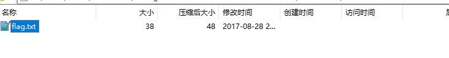

# 导语
[点击这里去答题](https://www.ichunqiu.com/battalion?q=4601)
<!-- more-->

# 正文
下载题目并解压，可以看到两个文件，一个pcapng和一个log

先notepad看看这个log
发现全是乱码，但是在179行有

于是打算复制下来放在winhex看看，然而178行也有部分内容，我又选不上，于是winhex打开log，然后复制内容粘贴到notepad，再把notepad的内容复制，贴回winhex，注意要选ascii hex。

可以看到Rar！，于是存出来，把拓展名改为rar

rar是被加密的

于是wireshark查看pcapng，直接导出http对象

（md还有个这图吓我一跳）

看看html，可以找到一段jsfuck

复制下来到浏览器控制台试一下

输入密码，拿到flag
