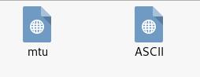
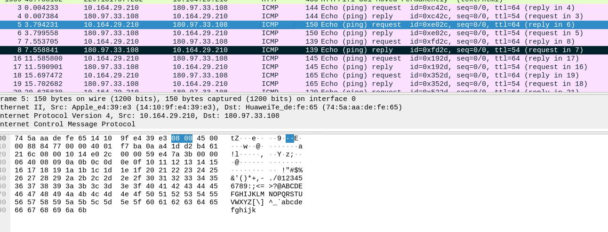

# 导语
[点击这里去答题](https://www.ichunqiu.com/battalion?q=4575)
<!-- more -->

# 要想会，先学会
题目是一个pcapng，用wireshark打开，先提取http对象，发现下面内容

并且他们都是打不开的，说明思路有问题，这顶多是个提示。于是查看数据包，可以发现有很多icmp数据，我们都知道icmp最常见的应用是ping，他只是看看网络通不通，他有这么多一定有东西，所以我们筛出icmp数据包。

可以发现数据包的长度都有所不同，且不同的内容全是ABCD啥的填充，结合弹出来的ascii，我们不难猜到这是ascii值，于是直接转换，发现是

所以应该有偏移，我们知道f和l的差是6，而150-144=6，所以设偏移为42，发现确实如此
