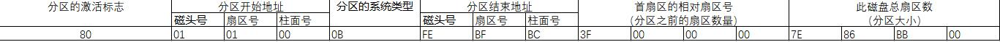
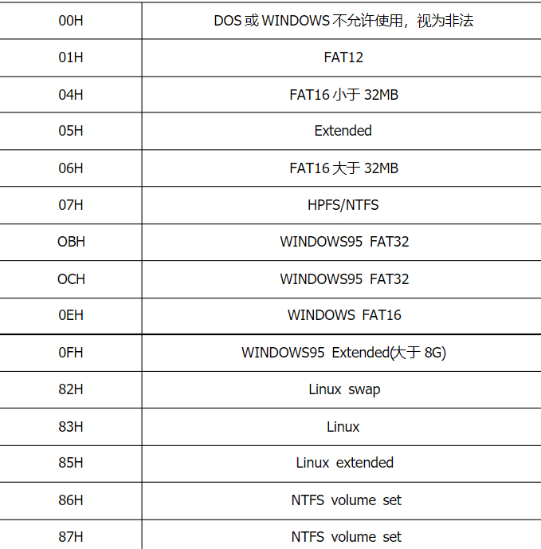

# 导语
今天我们来深入理解一下MBR中的DPT部分
<!--more -->
我们考试考的是MBR而不是GPT，而现在很多电脑都是GPT了，所以你看着可能有点脱离实际，有空应该会更新GPT。

# MBR
以前我们提到过主引导分区MBR（Master Boot Record），MBR的作用是什么呢？主要如下
1. 提供开机菜单选项：可以供用户选择启动哪个操作系统，这是多重引导功能。
2. 加载操作系统内核：每个操作系统都有自己的内核，需要引导程序来加载
3. 转交给其他引导程序：可以将工作移交给其他引导程序来进行上述操作。

其实引导加载程序除了可以安装在MBR中，还可以直接安装在每个分区的引导扇区(DBR)中，注意下，每个分区(主分区、逻辑分区)都有一个自己的启动扇区，专门用来安装引导加载程序

# DPT
在之前的博文“FAT32文件系统”中有简单的讲MBR的格式，DPT就在他的MBR512字节的后64字节，每个DPT表项的长度为16字节。比如：
80 01 01 00 0B FE BF FC 3F 00 00 00 7E 86 BB 00
这里我们直观地可以这样显示

其中，分区系统类型主要如下

然而我们有可能看到0f，这也是在之后的FAT LBA项目的结果，我们在这先不讨论了。

由于这块只有64个字节，也就是4个DPT表项，因此在MBR分区下主分区最多4个，更多的只能是拓展分区。而每个分区都有一块这样的数据块，可以链式的拓展分区。

参考链接
https://www.cnblogs.com/zhangming-blog/articles/5392115.html
https://blog.51cto.com/shitou118/212220