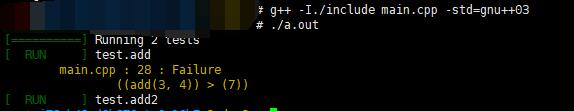

# 导语
菜bGun报名了他们学校的实训，听了老师对单元测试框架的讲解，觉得非常牛逼，打算写一篇博客整理整理。
<!-- more -->
# 测试程序
古话说得好，只要是程序，就有bug，因此，一个测试程序对于程序本身来说是很有必要的。虽然说通过测试不代表就没有bug，但至少说明程序是概率性正确的。咱就跟着实训来的例子来看看测试程序怎么写。

# 谷歌测试框架
谷歌有一个C++的测试框架gtest，我们在这个框架的基础上来看看。这是他的源码仓库：
https://github.com/google/googletest
其中还有一个介绍怎么整一个自己的测试模块的。
https://github.com/google/googletest/tree/master/googletest


## 步骤
gtest用cmake编译，所以如果你的电脑上没有cmake就去整一个
然后按照上面的教程，在clone下来的源码里执行
```shell
mkdir mybuild
cd mybuild
cmake ${GTEST_DIR}
```
这里的GTEST_DIR随便设。然后我们就会发现mybuild文件夹里出现了一些新的文件，其中包含Makefile


所以我们直接make+make install就可以了,我们可以发现很多的库文件和头文件被安装了。
然后就可以开始编写自己的测试模块了，这里我们就抄一下google自己的sample，测试下大于等于小于啥的
main.cpp:
```c++
#include <iostream>
#include <cstdio>
#include <cstdlib>
#include <queue>
#include <stack>
#include <algorithm>
#include <string>
#include <map>
#include <set>
#include <vector>
#include <mytest.h>
using namespace std;

int add(int a, int b) {
    return a + b;
}

TEST(test, add) {
    EXPECT_EQ(add(3, 4), 7);
    EXPECT_NE(add(3, 4), 8);
    EXPECT_GT(add(3, 4), 7);
    EXPECT_LT(add(3, 4), 8);
    EXPECT_GE(add(3, 4), 7);
    EXPECT_LE(add(3, 4), 7);
}

TEST(test, add2) {
    EXPECT_EQ(add(3, 4), 7);
    EXPECT_NE(add(3, 4), 8);
    EXPECT_GT(add(3, 4), 6);
    EXPECT_LT(add(3, 4), 8);
    EXPECT_GE(add(3, 4), 7);
    EXPECT_LE(add(3, 4), 7);
}

int main() {
    return RUN_ALL_TESTS();
}
```

我们引入了一个mytest.h的头文件，里面定义了我们测试文件所需要用到的宏和函数等等东西。
mytest.h:
```c++
#ifndef _MYTEST_H
#define _MYTEST_H

#include <string.h>

#define EXPECT(a, comp, b) { \
    if (!((a) comp (b))) \
        expect_printf(__FILE__, __LINE__,  \
        "((" #a ") " #comp " (" #b "))"); \
}
#define EXPECT_EQ(a, b) EXPECT(a, ==, b)
#define EXPECT_NE(a, b) EXPECT(a, !=, b)
#define EXPECT_GT(a, b) EXPECT(a, >, b)
#define EXPECT_GE(a, b) EXPECT(a, >=, b)
#define EXPECT_LT(a, b) EXPECT(a, <, b)
#define EXPECT_LE(a, b) EXPECT(a, <=, b)

#define COLOR(msg, code) "\033[" #code "m" msg "\033[0m"
#define GREEN(msg) COLOR(msg, 32)
#define YELLOW(msg) COLOR(msg, 33)
#define BLUE(msg) COLOR(msg, 34)
#define RED(msg) COLOR(msg, 35)

#define TEST(a, b) \
void a##_##b(); \
__attribute__((constructor)) \
void register_##a##_##b() { \
    add_test(a##_##b, #a "." #b); \
} \
void a##_##b()


struct TestData {
    void (*func)();
    char *func_name;
} func_arr[100];
int func_cnt = 0;

void add_test(void (*func)(), const char *func_name) {
    func_arr[func_cnt].func = func;
    func_arr[func_cnt].func_name = strdup(func_name);
    func_cnt += 1;
    return ;
}

void expect_printf(const char *file_name, int line_no, const char *msg) {
    printf(YELLOW("\t%s : %d : Failure\n"), file_name, line_no);
    printf(YELLOW("\t\t%s\n"), msg);
    return ;
}

int RUN_ALL_TESTS() {
    printf(GREEN("[==========] ") "Running %d tests\n", func_cnt);
    for (int i = 0; i < func_cnt; i++) {
        printf(GREEN("[  RUN     ] ") "%s\n", func_arr[i].func_name);
        func_arr[i].func();
    }
    return 0;
}

#endif

```

### 代码分析
首先我们看测试cpp里的这些内容
```c++
TEST(test, add) {
    EXPECT_EQ(add(3, 4), 7);
    EXPECT_NE(add(3, 4), 8);
    EXPECT_GT(add(3, 4), 7);
    EXPECT_LT(add(3, 4), 8);
    EXPECT_GE(add(3, 4), 7);
    EXPECT_LE(add(3, 4), 7);
}
```
其中的TEST和EXPECT_EQ等等，明显可看出是宏，于是我们在mytest.h里看看他们的定义
首先是EXPECT系列的宏定义，这里我们还把宏给封装了一下。
```c++
#define EXPECT(a, comp, b) { \
    if (!((a) comp (b))) \
        expect_printf(__FILE__, __LINE__,  \
        "((" #a ") " #comp " (" #b "))"); \
}
#define EXPECT_EQ(a, b) EXPECT(a, ==, b)
#define EXPECT_NE(a, b) EXPECT(a, !=, b)
#define EXPECT_GT(a, b) EXPECT(a, >, b)
#define EXPECT_GE(a, b) EXPECT(a, >=, b)
#define EXPECT_LT(a, b) EXPECT(a, <, b)
#define EXPECT_LE(a, b) EXPECT(a, <=, b)

```
宏的特点就是只替换，经过替换可以看出来他是判断条件是否成立，如果不成立就去调用expect_printf函数来输出错误，这里__FILE__ __LINE__ 都是编译器自带的变量。
于是我们来看看expect_printf函数
```c++
void expect_printf(const char *file_name, int line_no, const char *msg) {
    printf(YELLOW("\t%s : %d : Failure\n"), file_name, line_no);
    printf(YELLOW("\t\t%s\n"), msg);
    return ;
}
```
就是把东西打印出去罢了，不过我们可以看到这里又有了宏YELLOW
```c++
#define COLOR(msg, code) "\033[" #code "m" msg "\033[0m"
#define GREEN(msg) COLOR(msg, 32)
#define YELLOW(msg) COLOR(msg, 33)
#define BLUE(msg) COLOR(msg, 34)
#define RED(msg) COLOR(msg, 35)
```
而COLOR的宏定是这样，就是shell变颜色高亮的输出语法。


TEST的宏定义：
```c++
#define TEST(a, b) \
void a##_##b(); \
__attribute__((constructor)) \
void register_##a##_##b() { \
    add_test(a##_##b, #a "." #b); \
} \
```

这里定义了一个构造器函数register_a_b(),他调用add_test(a_b,"a.b"),其中a_b是函数指针，a.b是函数名。

```c++
void add_test(void (*func)(), const char *func_name) {
    func_arr[func_cnt].func = func;
    func_arr[func_cnt].func_name = strdup(func_name);
    func_cnt += 1;
    return ;
}
```

而add_test函数就这，在这个函数上面几行我们定义了func_arr和func_cnt的全局变量，前者的类型是void指针+char数组，存储函数的函数指针和函数名，后者的类型是int，记录一共有几个函数。

最后就是我们在main.cpp中调用的函数
```c++
int RUN_ALL_TESTS() {
    printf(GREEN("[==========] ") "Running %d tests\n", func_cnt);
    for (int i = 0; i < func_cnt; i++) {
        printf(GREEN("[  RUN     ] ") "%s\n", func_arr[i].func_name);
        func_arr[i].func();
    }
    return 0;
}
```
就是循环func_arr中存储的测试函数来测试。
这样，我们的测试就成了。

# 看看结果
